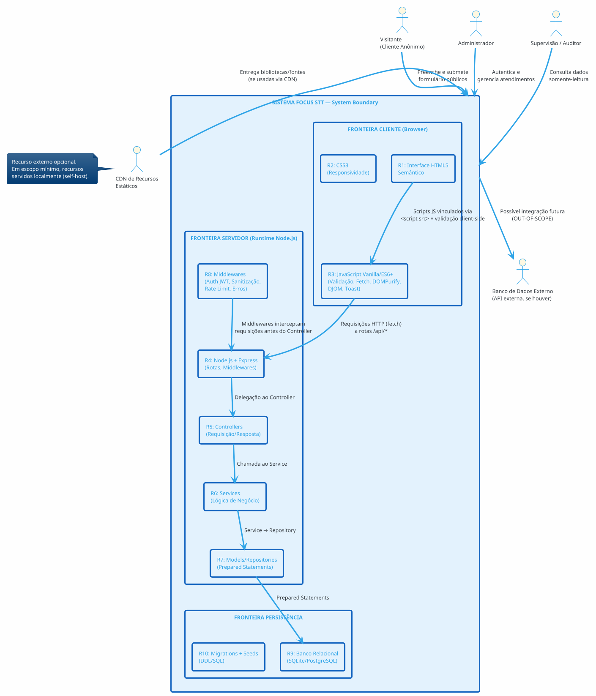
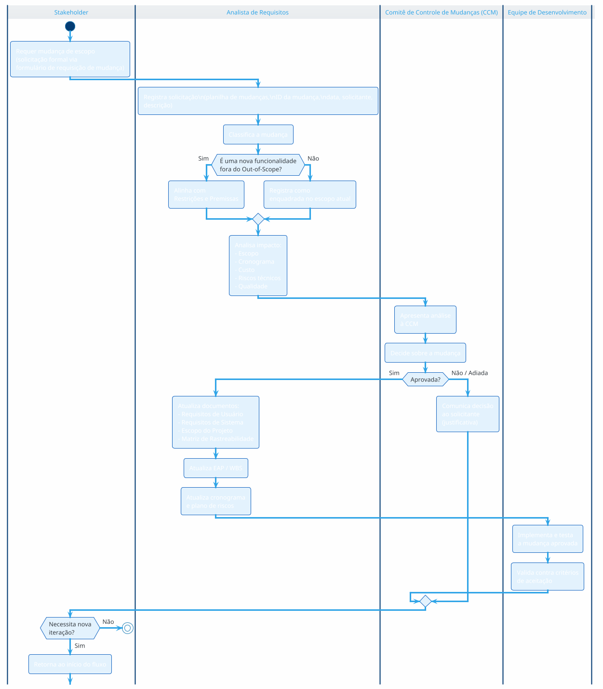

# Escopo do Projeto — Sistema Focus STT

**Projeto:** Focus STT — Plataforma Full-Stack de Gestão de Atendimentos  
**Normas de Referência:** OMG UML 2.5.1, ISO/IEC/IEEE 29148:2018, PMBOK 7ª Edição, ISO/IEC 25010  
**Versão do Documento:** 1.0.0  
**Data de Emissão:** 02/09/2026  
**Classificação:** Documento de Escopo e Governança do Projeto (Project Scope Statement)  
**Stack Tecnológica:** HTML5 Semântico, CSS3, JavaScript Vanilla/ES6+, Node.js, Express, SQLite/PostgreSQL  

---

## Sumário

1. [Justificativa de Engenharia e Objetivos SMART](#1-justificativa-de-engenharia-e-objetivos-smart)
2. [Delimitação das Fronteiras do Sistema (System Boundary)](#2-delimitação-das-fronteiras-do-sistema-system-boundary)
3. [Escopo do Produto por Módulos Arquiteturais](#3-escopo-do-produto-por-módulos-arquiteturais)
4. [Diagrama de Componentes UML 2.5.1](#4-diagrama-de-componentes-uml-251)
5. [Diagrama de Implantação (Deployment Diagram)](#5-diagrama-de-implantação-deployment-diagram)
6. [Estrutura Analítica do Projeto (EAP / WBS)](#6-estrutura-analítica-do-projeto-eap--wbs)
7. [Limites Explícitos do Projeto (In-Scope & Out-of-Scope)](#7-limites-explícitos-do-projeto-in-scope--out-of-scope)
8. [Matriz de Critérios de Aceitação, Restrições/Premissas e Riscos Técnicos](#8-matriz-de-critérios-de-aceitação-restriçõespremissas-e-riscos-técnicos)
9. [Governança e Processo de Controle de Mudanças de Escopo](#9-governança-e-processo-de-controle-de-mudanças-de-escopo)

---

## 1. Justificativa de Engenharia e Objetivos SMART

### 1.1 Justificativa de Engenharia (Business Case)

O projeto **Focus STT** surge da necessidade de modernizar e digitalizar o processo de gestão de atendimentos, hoje realizado de forma manual (papel, planilhas ou canais assíncronos não padronizados). A solução visa eliminar gargalos operacionais, reduzir duplicidade de dados e proporcionar rastreabilidade completa das demandas.

**Problemas Atuais Identificados:**
- Ausência de um canal **público padronizado** para abertura de atendimentos.
- Falta de **rastreabilidade** (quem, quando, de que status, para qual status).
- **Duplicidade** de informações e perda de dados por registro manual.
- Impossibilidade de **auditoria** das ações administrativas.
- **Exposição a riscos de segurança** (depêndencia de planilhas/comunicação não segura).

**Solução Proposta:**
Uma aplicação web full-stack composta por:
1. **Frontend** em HTML5 semântico, CSS3 e JavaScript Vanilla/ES6+ — formulário público com validação client-side e painel administrativo com gerenciamento completo.
2. **Backend** em Node.js com framework Express — rotas REST, middlewares de segurança, sanitização, autenticação JWT e tratamento de erros.
3. **Persistência** em banco de dados relacional SQLite (desenvolvimento) / PostgreSQL (produção), com **Prepared Statements** para prevenção de SQL Injection.

**Benefícios Esperados:**
- Redução de ~80% no tempo de registro de atendimentos.
- Rastreabilidade completa de todas as alterações via trilha de auditoria.
- Conformidade com boas práticas de segurança (OWASP Top 10 mitigado).
- Interface acessível (WCAG 2.1 AA) e responsiva.

### 1.2 Objetivos SMART

| ID | Objetivo SMART | Especificações Mensuráveis | Prazo |
|----|---------------|---------------------------|-------|
| **OBJ-01** | Disponibilizar um formulário público HTML5 semântico com validação client-side e sanitização. | O formulário deve: (a) ser acessível via URL pública; (b) validar 100% dos campos obrigatórios client-side; (c) sanitizar entradas contra XSS; (d) submeter dados via POST `/api/atendimentos`; (e) exibir feedback visual (Toast). | 5 dias úteis |
| **OBJ-02** | Implementar backend Node.js/Express com autenticação JWT e autorização RBAC. | O backend deve: (a) expor as rotas definidas no contrato de API; (b) proteger rotas administrativas via `Authorization: Bearer <token>`; (c) retornar 401/403 corretamente para acesso não autorizado; (d) validar credenciais com bcrypt. | 8 dias úteis |
| **OBJ-03** | Implementar gestão completa de atendimentos (CRUD + alteração de status) com trilha de auditoria. | O sistema deve: (a) listar com paginação; (b) buscar por ID; (c) alterar status validando máquina de estados; (d) excluir com soft delete; (e) registrar todas as ações em `trilha_auditoria`. | 10 dias úteis |
| **OBJ-04** | Garantir a segurança contra XSS e SQL Injection em 100% dos pontos de entrada. | 100% das queries usam Prepared Statements; 100% dos campos string sanitizados server-side; headers de segurança aplicados via helmet; nenhuma vulnerabilidade crítica na varredura OWASP ZAP. | 6 dias úteis |
| **OBJ-05** | Entregar interface administrativa com exclusão segura (confirmação em 2 etapas) e feedback Toast. | O painel deve: (a) exibir lista paginada; (b) permitir alterar status com validação de transição; (c) excluir com modal de confirmação em 2 etapas; (d) atualizar DOM sem reload. | 7 dias úteis |
| **OBJ-06** | Documentar arquiteturas UML, DDL do banco e contratos de API para auditoria. | Os 3 artefatos documentais (`requisitos_de_usuario.md`, `requisitos_de_sistema.md`, `escopo_do_projeto.md`) devem estar completos, sem placeholders, prontos para auditoria. | 4 dias úteis |
| **OBJ-07** | Garantir usabilidade e acessibilidade (WCAG 2.1 AA). | 100% dos formulários com labels associados, contrastes adequados (≥4.5:1) e navegação por teclado. | 3 dias úteis |

**Prazo Total Estimado:** 43 dias úteis (aproximadamente 2 meses de calendário).

---

## 2. Delimitação das Fronteiras do Sistema (System Boundary)

### 2.1 Diagrama de Contexto (PlantUML)



### 2.2 Descrição das Fronteiras (System Boundary)

| Fronteira | Componentes | Responsabilidade | Comunicação com o Exterior |
|-----------|-------------|------------------|---------------------------|
| **Fronteira Cliente (Browser)** | R1: Interface HTML5; R2: CSS3; R3: JS Vanilla | Renderização da interface, validação client-side, sanitização DOM (DOMPurify), chamadas assíncronas (`fetch`), feedback via Toast/DOM, gerenciamento de token. | Comunica-se com o servidor via requisições HTTP (GET/POST/PATCH/DELETE) e via HTML/CSS/JS estáticos servidos pelo Express. |
| **Fronteira Servidor (Node.js)** | R4: Express; R5: Controllers; R6: Services; R7: Models; R8: Middlewares | Processamento de requisições, autenticação, autorização, sanitização, lógica de negócio, acesso a dados. Roda no Event Loop não-bloqueante do Node.js (libuv). | Comunica-se com o Database Engine via Prepared Statements e com o Cliente via respostas HTTP JSON. |
| **Fronteira Persistência** | R9: Banco (SQLite/PostgreSQL); R10: Migrations/Seeds | Armazenamento persistente, integridade referencial, constraints CHECK, transações ACID, índices de performance. | Executa queries parametrizadas enviadas pelos Models/Repositories. |
| **Recursos Externos (Opcionais)** | CDN de recursos estáticos, APIs externas | Entrega de bibliotecas/fontes; integrações futuras. | **Out-of-Scope** para v1.0 (recursos self-host). |

**Regras da Fronteira (System Boundary Rules):**
- O sistema é **fechado** em relação a APIs externas de terceiros (fora do escopo v1.0).
- O sistema **aceita** comunicação HTTP de qualquer navegador client compatível.
- O sistema **não** expõe conexões diretas ao banco (somente via Models/Repositories com Prepared Statements).
- Os recursos estáticos são servidos localmente pelo Express (self-host), não por CDN externa — exceto opt-in com fallback.

---

## 3. Escopo do Produto por Módulos Arquiteturais

### 3.1 Módulo 01 — Frontend (Interface Cliente)

**Objetivo:** Interface HTML5 semântica, responsiva e acessível com validação client-side e feedback visual.

| Entregável Físico | Arquivo(s) | Descrição |
|-------------------|-----------|-----------|
| Página do Formulário Público | `/public/index.html` | HTML5 semântico com `<form>`, `<input>`, `<label>`, `<select>`, `<textarea>`, atributos `aria-*`, estrutura responsiva. |
| Painel Administrativo | `/public/admin/dashboard.html` | HTML5 do painel com tabela de atendimentos, paginação, filtros, modais de confirmação (2 etapas) e dropdowns de status. |
| Página de Login | `/public/admin/login.html` | HTML5 do formulário de autenticação. |
| Estilos CSS3 | `/public/css/style.css`, `/public/css/admin.css`, `/public/css/responsive.css` | Estilos responsivos com Media Queries, themes, classes para estados de validação e modais. |
| Modais e Toasts CSS | `/public/css/components.css` | Estilos dos componentes modais, toasts e spinners. |
| Scripts de Validação Client-Side | `/public/js/validacao.js` | Lógica JS de validação (required, minlength, pattern, e-mail, telefone, tipo). |
| Script Sanitizador DOM | `/public/js/sanitizacao.js` | Sanitização client-side com DOMPurify (import local) para remover tags maliciosas. |
| Script de Submissão (Fetch) | `/public/js/formulario.js` | Manipulação do evento submit, construção de payload JSON, chamada `fetch`, tratamento de resposta, reset de formulário. |
| Script do Login | `/public/js/login.js` | Coleta de credenciais, chamada POST `/api/auth/login`, armazenamento de token, redirecionamento. |
| Script do Painel | `/public/js/dashboard.js` | Carregamento da lista, paginação, filtros, renderização dinâmica da tabela via DOM. |
| Script de Alteração de Status | `/public/js/status.js` | Chamada PATCH, atualização dinâmica da linha, feedback Toast. |
| Script de Exclusão (2 Etapas) | `/public/js/exclusao.js` | Modais de confirmação em 2 etapas, validação de digitação, chamada DELETE, remoção de linha. |
| API Client Helper | `/public/js/api.js` | Abstração da camada `fetch` (injeção de headers Authorization, tratamento de erros). |
| Componente Toast | `/public/js/toast.js` | Implementação do sistema de notificações Toast via DOM. |

### 3.2 Módulo 02 — Backend (Servidor Node.js/Express)

**Objetivo:** API RESTful segura, com arquitetura em camadas e middlewares de segurança.

| Entregável Físico | Arquivo(s) | Descrição |
|-------------------|-----------|-----------|
| Ponto de Entrada do Servidor | `/server/server.js` | Configuração do Express, middlewares globais, montagem de rotas, tratamento de erros, `listen()`. |
| Configuração Principal | `/server/app.js` | Factory de aplicação Express (testável/serializável). |
| Configuração de Variáveis de Ambiente | `/server/config/env.js` | Carregamento e validação de variáveis `.env` via `dotenv`. |
| Conexão com o Banco | `/server/config/database.js` | Pool de conexões (pg para PostgreSQL / sqlite3 para SQLite) com configuração de pool. |
| Rotas Públicas | `/server/routes/rotasPublicas.js` | Definir rotas públicas (health, criação de atendimento). |
| Rotas de Autenticação | `/server/routes/rotasAuth.js` | Rotas de login/logout/me. |
| Rotas Administrativas | `/server/routes/rotasAdmin.js` | Rotas protegidas de gestão de atendimentos. |
| Controllers | `/server/controllers/atendimentoController.js`, `/server/controllers/authController.js` | Orquestração de request/response, validação de parâmetros. |
| Services | `/server/services/atendimentoService.js`, `/server/services/authService.js`, `/server/services/auditoriaService.js` | Lógica de negócio: criação, listagem, alteração de status (máquina de estados), exclusão, autenticação, auditoria. |
| Models/Repositories | `/server/models/atendimentoModel.js`, `/server/models/usuarioModel.js`, `/server/models/auditoriaModel.js` | Acesso ao banco via Prepared Statements. |
| Middleware de Autenticação | `/server/middlewares/auth.js` | Verificação de JWT e RBAC. |
| Middleware de Sanitização | `/server/middlewares/sanitizacao.js` | Sanitização de inputs (XSS). |
| Middleware de Rate Limiting | `/server/middlewares/rateLimiter.js` | Controle de requisições por IP. |
| Middleware de Erros | `/server/middlewares/erros.js` | Tratamento centralizado de erros. |
| Middleware de Auditoria | `/server/middlewares/auditoria.js` | Registro de trilha de auditoria. |
| Utilidades | `/server/utils/validadores.js` | Funções de validação reutilizáveis. |
| Utilidades de Segurança | `/server/utils/seguranca.js` | Helpers de criptografia/bcrypt. |
| Enums/Constantes | `/server/utils/enums.js` | Enums de Status, Tipo, Role, Ações de Auditoria. |

### 3.3 Módulo 03 — Persistência (Banco de Dados Relacional)

**Objetivo:** Esquema relacional com integridade, constraints e índices de performance.

| Entregável Físico | Arquivo(s) | Descrição |
|-------------------|-----------|-----------|
| Migrations DDL | `/migrations/001_criar_tabelas.sql` | Criação das tabelas `atendimentos`, `usuarios`, `trilha_auditoria` com constraints CHECK, PKs, FKs, defaults e índices. |
| Seeds | `/seeds/001_seed_admin.sql` | Inserção do administrador padrão com hash bcrypt pré-calculado. |
| Rodapé de Migrations | `/migrations/rollback/001_rollback.sql` | Comandos de rollback (`DROP TABLE`). |

### 3.4 Módulo 04 — Configuração e Entrega

| Entregável Físico | Arquivo(s) | Descrição |
|-------------------|-----------|-----------|
| Arquivo `.env.example` | `/.env.example` | Template de variáveis de ambiente (não versionado o `.env` real). |
| `package.json` | `/package.json` | Dependências e scripts de execução/teste. |
| Arquivo `.gitignore` | `/.gitignore` | Exclusão de `.env`, `node_modules`, etc. |

---

## 4. Diagrama de Componentes UML 2.5.1

### 4.1 Diagrama de Componentes (PlantUML)

```plantuml
@startuml Componentes_UML
!theme cerulean
skinparam backgroundColor #FEFEFE
skinparam component {
  BorderColor #1565C0
  BackgroundColor #E1F5FE
  FontSize 12
}
skinparam database {
  BorderColor #1B5E20
  BackgroundColor #C8E6C9
}
skinparam node {
  BorderColor #E65100
  BackgroundColor #FFF3E0
}
skinparam arrowColor #37474F

' =========================================================
' COMPONENTE: FRONTEND (Browser)
' =========================================================
package "FRONTEND — Interface Cliente" as FRONT {
  component "Interface HTML5\nSemântico" as HTML <<«artifact»\n.phtml>>
  component "Folhas de Estilo CSS3" as CSS <<«artifact»\n.css>>
  component "Scripts JS\n(Vanilla/ES6+)" as JS <<«artifact»\n.js>>

  component "Validação\nClient-Side" as VAL <<«component»>>
  component "Sanitização\nDOMPurify" as SAN <<«component»>>
  component "API Client\n(fetch)" as APICLI <<«component»>>
  component "Componente\nToast" as TOAST <<«component»>>

  HTML --> JS : <<uses>>\n<script src>
  JS --> VAL : <<uses>>
  JS --> SAN : <<uses>>
  JS --> APICLI : <<uses>>
  JS --> TOAST : <<uses>>


}

' =========================================================
' COMPONENTE: SERVIDOR BACKEND (Express)
' =========================================================
package "BACKEND — Servidor Node.js" as BACK {
  component "Express Router\n(Rotas)" as ROUTER <<«component»>> <<port:HTTP_in>>
  component "Middleware\nexpress.json" as MWJSON <<«component»>>
  component "Middleware\nSanitização" as MWSAN <<«component»>>
  component "Middleware\nJWT Auth + RBAC" as MWAUTH <<«component»>>
  component "Middleware\nRate Limiter" as MWRATE <<«component»>>
  component "Middleware\nErros" as MWERR <<«component»>>

  component "Controllers" as CTRL <<«component»>>
  component "Services\n(Lógica de Negócio)" as SVC <<«component»>>
  component "Models/\nRepositories" as MODEL <<«component»>>
  component "Trilha de\nAuditoria" as AUDIT <<«component»>>

  component "Config\n(.env/database)" as CONFIG <<«component»>>

  ' Conexões internas (portas providas/requeridas)
  APICLI ..> ROUTER : <<HTTP Request>>\nRequires: REST API\n(fetch('/api/*'))

  ROUTER -- MWRATE : <<pipeline>>
  MWRATE -- MWJSON : <<pipeline>>
  MWJSON -- MWSAN : <<pipeline>>
  MWSAN -- MWAUTH : <<pipeline>>

  MWAUTH -- CTRL : autoriza\nacesso
  MWJSON -- CTRL : passa\ndados

  CTRL -- SVC : delega\nlógica de negócio

  SVC -- MODEL : acesso\na dados
  SVC -- AUDIT : registra\nauditoria

  MODEL -- CONFIG : conexão\n(pool)
  CONFIG -- DB : Prepared\nStatements

  CTRL ..> MWERR : erro →\ncentralizado
  SVC ..> MWERR : erro →\ncentralizado

  ' Porta de saída HTTP
  ROUTER : "«provided interface»\nREST API\n(/api/v1/*)"
  ROUTER : "«required interface»\nHTTP request\n(de qualquer client)"
}

' =========================================================
' COMPONENTE: PERSISTÊNCIA
' =========================================================
database "SQLite / PostgreSQL\n(Database Engine)" as DB <<«database»>>
database "Trilha de\nAuditoria (append-only)" as DBAUDIT <<«database»>>

' =========================================================
' COMPONENTES/ATORES EXTERNOS
' =========================================================
actor "Navegador Web\n(User-Agent)" as BROWSER
actor "Visitante /\nAdmin" as USER

BROWSER -> HTML : renderiza\n<<use>>

note right of HTML
  As requisições HTTP são feitas
  pela interface via API Client,
  utilizando rotas REST /api/*
end note

note bottom of DB
  Registros de atendimento e usuários.
  Soft delete (deleted_at).
  Constraints CHECK + índices.
end note

note bottom of DBAUDIT
  Append-only.
  Registros nunca atualizados/excluídos.
end note

@enduml
```

### 4.2 Portas e Interfaces (Ports & Interfaces)

| Componente | Porta | Interface Provida (Provided) | Interface Requerida (Required) |
|-----------|-------|------------------------------|--------------------------------|
| **Express Router** | `HTTP_in` (porta de entrada) | REST API `/api/v1/*` (GET/POST/PATCH/DELETE) | HTTP request de qualquer client compatível |
| **Middleware Auth** | — | Verificação de JWT (`Authorization: Bearer`) | — |
| **Controllers** | — | Orquestrar request/response | — |
| **Services** | — | Lógica de negócio validada | — |
| **Models/Repositories** | — | Acesso a dados via Prepared Statements | Pool de conexões do banco |
| **Auditoria** | — | Registro append-only | — |

**Regras de Interface:**
- O Frontend **requer** a interface REST do backend (`provided interface` do Router).
- O Backend **provê** a interface REST e **requer** a interface de persistência do banco.
- As portas são fracamente acopladas (um componente depende de interfaces, não de implementações concretas).
- A trilha de auditoria é um componente desacoplado, consumido pelos Services.

---

## 5. Diagrama de Implantação (Deployment Diagram)

### 5.1 Diagrama de Implantação (PlantUML)

```plantuml
@startuml Deployment
!theme cerulean
skinparam backgroundColor #FEFEFE
skinparam node {
  BorderColor #37474F
  BackgroundColor #ECEFF1
}
skinparam node {
  BackgroundColor #E8EAF6
}
skinparam database {
  BackgroundColor #C8E6C9
}
skinparam artifact {
  BackgroundColor #FFF9C4
}
skinparam component {
  BackgroundColor #E1F5FE
}

' =========================================================
' NODE 1: Cliente (Navegador)
' =========================================================
node "NO1: Cliente — Navegador Web" as CLIENTE {
  artifact "index.html\n(Formulário Público)" as A_HTML1
  artifact "admin/login.html\n(Página de Login)" as A_HTML2
  artifact "admin/dashboard.html\n(Painel Admin)" as A_HTML3
  artifact "js/*.js\n(Validação, Fetch,\nDOMPurify, Toast)" as A_JS
  artifact "css/*.css\n(Responsividade)" as A_CSS

  node "Runtime: V8 Engine (Browser)" as BROWSER_RUNTIME
  BROWSER_RUNTIME -up- A_JS
}

' =========================================================
' NODE 2: Servidor de Aplicação (Node.js)
' =========================================================
node "NO2: Servidor — Runtime Node.js (V8)" as SERVIDOR {
  artifact "server.js\n(app Express)" as A_SRV
  artifact "config/env.js\n(.env)" as A_ENV
  artifact "config/database.js\n(pool de conexões)" as A_DB
  artifact "routes/*.js" as A_ROUTES
  artifact "controllers/*.js" as A_CTRL
  artifact "services/*.js" as A_SVC
  artifact "models/*.js" as A_MODEL
  artifact "middlewares/*.js" as A_MW

  node "Processo Principal\n(Event Loop não-bloqueante)" as PROCESS {
    A_SRV -up- PROCESS
    A_ROUTES -up- PROCESS
    A_CTRL -up- PROCESS
    A_SVC -up- PROCESS
    A_MODEL -up- PROCESS
    A_MW -up- PROCESS
  }

  node "Thread Pool (libuv)\npara I/O de banco" as THREADPOOL
  A_MODEL --> THREADPOOL : prepared statements\n(assíncrono)
}

' =========================================================
' NODE 3: Servidor de Banco de Dados
' =========================================================
node "NO3: Servidor de Banco de Dados" as DBSERVER {
  database "Instância\nSQLite / PostgreSQL" as DB_INST
  artifact "migrations/*.sql\n(DDL)" as A_MIGR
  artifact "seeds/*.sql" as A_SEED
  DB_INST -down- A_MIGR
  DB_INST -down- A_SEED
  DB_INST : "Tabelas:\natendimentos,\nusuarios,\ntrilha_auditoria"
}

' =========================================================
' CONEXÕES DE COMUNICAÇÃO
' =========================================================
CLIENTE -right-> SERVIDOR : "HTTPS/HTTP\n(requisições REST /api/*)\nPorta 3000 (dev) / 443 (prod)"
SERVIDOR -down-> DBSERVER : "Conexão pool\n(Prepared Statements)\nPorta SQLite (local) /\n5432 (PostgreSQL)"

note right of CLIENTE
  Protocolo: HTTP/HTTPS
  Cabeçalho: Authorization: Bearer <JWT>
  Content-Type: application/json
end note

note bottom of SERVIDOR
  Variáveis de Ambiente (.env):
  - PORT (3000)
  - JWT_SECRET (mín. 256 bits)
  - JWT_EXPIRATION (3600s)
  - DB_HOST, DB_PORT, DB_NAME,
    DB_USER, DB_PASSWORD
  - NODE_ENV (development/production)
  - CORS_ORIGIN
  - BCRYPT_ROUNDS (12)
end note

note bottom of DBSERVER
  - SQLite: arquivo local
    (focus_stt.db)
  - PostgreSQL: instância
    dedicada porta 5432
  - Backup diário automático
end note

@enduml
```

### 5.2 Documentação das Variáveis de Ambiente (.env)

| Variável | Descrição | Obrigatória | Padrão | Sensível |
|----------|-----------|-------------|--------|----------|
| `PORT` | Porta de escuta do servidor | Sim | `3000` | Não |
| `NODE_ENV` | Ambiente de execução | Sim | `development` | Não |
| `JWT_SECRET` | Chave secreta para assinatura JWT (≥256 bits) | **Sim** (produção) | — | **Sim** |
| `JWT_EXPIRATION` | Tempo de expiração do token em segundos | Não | `3600` (1h) | Não |
| `BCRYPT_ROUNDS` | Fator de custo do bcrypt | Não | `12` | Não |
| `DB_HOST` | Host do banco de dados | Sim (PostgreSQL) | `localhost` | Não |
| `DB_PORT` | Porta do banco | Sim (PostgreSQL) | `5432` | Não |
| `DB_NAME` | Nome do banco | Sim | `focus_stt` | Não |
| `DB_USER` | Usuário do banco | Sim (PostgreSQL) | `postgres` | Não |
| `DB_PASSWORD` | Senha do banco | Sim (PostgreSQL) | — | **Sim** |
| `DIALECT` | Motor do banco (`sqlite` / `postgres`) | Sim | `sqlite` | Não |
| `CORS_ORIGIN` | Origens permitidas para CORS | Não | `http://localhost:3000` | Não |

---

## 6. Estrutura Analítica do Projeto (EAP / WBS)

### 6.1 EAP Textual Hierárquica

```
FOCUS STT (Projeto)
│
├── 1.0 Gerenciamento do Projeto
│   ├── 1.1 Plano de Escopo
│   ├── 1.2 Plano de Cronograma
│   ├── 1.3 Plano de Riscos
│   └── 1.4 Relatórios de Status
│
├── 2.0 Análise e Documentação
│   ├── 2.1 Levantamento de Requisitos de Usuário
│   │   ├── 2.1.1 Identificação de Atores
│   │   ├── 2.1.2 Diagrama de Casos de Uso
│   │   ├── 2.1.3 Catálogo de Requisitos (RU)
│   │   ├── 2.1.4 Histórias de Usuário (BDD/Gherkin)
│   │   └── 2.1.5 Diagramas de Sequência do Usuário
│   ├── 2.2 Levantamento de Requisitos de Sistema
│   │   ├── 2.2.1 Requisitos Funcionais (RSF)
│   │   ├── 2.2.2 Requisitos Não Funcionais (RSNF)
│   │   ├── 2.2.3 Diagramas de Sequência de Backend
│   │   ├── 2.2.4 Diagrama de Classes + OCL
│   │   ├── 2.2.5 Dicionário Técnico (DDL)
│   │   └── 2.2.6 Contratos de API + Rastreabilidade
│   └── 2.3 Escopo e Governança
│       ├── 2.3.1 Fronteiras do Sistema
│       ├── 2.3.2 EAP / WBS
│       ├── 2.3.3 Limites In/Out-Scope
│       ├── 2.3.4 Matrizes (Aceitação, Riscos)
│       └── 2.3.5 Controle de Mudanças
│
├── 3.0 Desenvolvimento Frontend
│   ├── 3.1 Estrutura HTML5 (index, login, dashboard)
│   ├── 3.2 Estilos CSS3 Responsivos
│   ├── 3.3 Validação Client-Side
│   ├── 3.4 Sanitização DOM (DOMPurify)
│   ├── 3.5 API Client (fetch) e Toast
│   ├── 3.6 Painel Admin (listagem, paginação, filtros)
│   ├── 3.7 Alteração de Status (DOM update)
│   └── 3.8 Exclusão Segura (modais 2 etapas)
│
├── 4.0 Desenvolvimento Backend
│   ├── 4.1 Configuração Servidor Express
│   ├── 4.2 Middlewares (json, sanitização, auth, rate limit, erros)
│   ├── 4.3 Rotas Públicas e de Auth
│   ├── 4.4 Rotas Administrativas
│   ├── 4.5 Controllers
│   ├── 4.6 Services (lógica, máquina de estados)
│   ├── 4.7 Models/Repositories (Prepared Statements)
│   └── 4.8 Trilha de Auditoria
│
├── 5.0 Banco de Dados
│   ├── 5.1 Migrations DDL (tabelas, constraints, índices)
│   ├── 5.2 Seeds (usuário admin)
│   └── 5.3 Configuração do Pool de Conexões
│
├── 6.0 Segurança
│   ├── 6.1 Criptografia de Senhas (bcrypt)
│   ├── 6.2 Geração/Validação de JWT
│   ├── 6.3 Sanitização XSS + Prepared Statements
│   ├── 6.4 Rate Limiting
│   ├── 6.5 Headers de Segurança (helmet)
│   └── 6.6 Trilha de Auditoria
│
├── 7.0 Testes e Qualidade
│   ├── 7.1 Testes Unitários (Services, Models)
│   ├── 7.2 Testes de Integração (API)
│   ├── 7.3 Testes de Segurança (varredura XSS/SQLi)
│   ├── 7.4 Testes de Usabilidade (WCAG)
│   └── 7.5 Testes de Performance
│
└── 8.0 Implantação e Entrega
    ├── 8.1 Configuração do Ambiente (produção)
    ├── 8.2 Pipeline de Deploy
    ├── 8.3 Backup do Banco
    └── 8.4 Documentação Final e Treinamento
```

### 6.2 Dicionário de Entregáveis (WBS Dictionary)

| Código EAP | Nome do Entregável | Descrição | Critério de Aceite |
|-----------|--------------------|-----------|--------------------|
| 2.1.3 | Catálogo de Requisitos de Usuário | Documento `requisitos_de_usuario.md` com RU completos | Aprovado pela Stakeholder; sem placeholders |
| 2.2.1 | Requisitos Funcionais de Sistema | Documento `requisitos_de_sistema.md` com RSF | Aprovado; especifica rotas/payloads/status |
| 2.3.2 | EAP / WBS | Estrutura analítica do projeto | Hierarquia completa; dicionário de entregáveis |
| 3.1 | Páginas HTML5 | `index.html`, `login.html`, `dashboard.html` | HTML5 válido, semântico, responsivo |
| 4.1 | Servidor Express | `server.js` + `app.js` | Servidor inicia; rotas respondem |
| 4.6 | Máquina de Estado de Status | Lógica em `atendimentoService.js` | Todas as transições válidas/inválidas cobertas |
| 5.1 | Migrations DDL | Arquivos `.sql` | Tabelas com constraints e índices corretos |
| 6.2 | JWT Auth | Middleware + Service | Rotas protegidas retornam 401/200 corretos |

---

## 7. Limites Explícitos do Projeto (In-Scope & Out-of-Scope)

### 7.1 Dentro do Escopo (In-Scope)

1. **Formulário público** de abertura de atendimento em HTML5 semântico com validação client-side.
2. **Sanitização client-side** via DOMPurify (XSS) e **sanitização server-side** via express-validator.
3. **Backend Node.js/Express** com as rotas REST definidas no contrato de API.
4. **Autenticação administrativa** via JWT (`Authorization: Bearer <token>`).
5. **Autorização RBAC** (roles `admin` e `viewer`).
6. **Gestão de atendimentos**: criação, listagem paginada, busca por ID, alteração de status (máquina de estados), exclusão segura (soft delete).
7. **Trilha de auditoria** (append-only) para todas as ações.
8. **Banco de dados relacional** SQLite (dev) / PostgreSQL (produção) com Prepared Statements.
9. **Prevenção de SQL Injection** via parametrização e de XSS via sanitização.
10. **Rate limiting** e **headers de segurança** (helmet).
11. **Feedback visual** via Toasts/DOM.
12. **Exclusão segura em duas etapas** (modal de confirmação).
13. **Documentação UML** (casos de uso, sequência, classes, componentes, implantação, contexto).
14. **Recursos estáticos self-host** (sem dependência obrigatória de CDN externa).

### 7.2 Fora do Escopo (Out-of-Scope)

1. **Autenticação de visitantes** (criação de conta pública, login social, OAuth, OpenID Connect).
2. **Recuperação de senha** (fluxo esqueci senha, e-mail de reset).
3. **Painel de relatórios / dashboards analíticos** com gráficos (Chart.js, Recharts, etc.).
4. **Notificações por e-mail ou SMS** (Webhook de notificação, integração SMTP).
5. **Integração com APIs externas de terceiros** (gateways de pagamento, CRM, ERP, sistemas legados).
6. **Upload de arquivos/anexos** (imagens, documentos em atendimentos).
7. **Chat em tempo real / WebSockets** para comunicação com o solicitante.
8. **Aplicativo mobile nativo** (Android/iOS via React Native/Flutter).
9. **Interface em múltiplos idiomas (i18n)**.
10. **Sistema de filas/priorização automática** (fila de espera, SLA automático).
11. **Módulo de financeiro/pagamentos.**
12. **Replicação de banco multi-regional / clusterização avançada.**
13. **Multitenancy** (suporte a múltiplas organizações inquilinas).
14. **Versionamento/migrations automatizadas em runtime** (executadas só em deploy consciente).
15. **Assinatura digital / carimbo de tempo legal.**
16. **Uso de CDN externa obrigatória** (recursos podem ser self-host, sem dependência de terceiros).

> **Nota:** Qualquer item listado como Out-of-Scope que venha a ser solicitado durante o projeto deverá passar pelo **Processo de Controle de Mudanças de Escopo** descrito na Seção 9.

---

## 8. Matriz de Critérios de Aceitação, Restrições/Premissas e Riscos Técnicos

### 8.1 Matriz de Critérios de Aceitação (CA)

| ID CA | Critério de Aceitação | Código DO Entregável | Método de Verificação | Resultado Esperado |
|-------|----------------------|----------------------|-----------------------|--------------------|
| **CA-01** | O formulário público é acessível via URL base e renderiza HTML5 semântico. | 3.1 | Teste funcional manual (navegador); validação HTML (W3C) | Formulário renderiza; validação HTML5 sem erros |
| **CA-02** | Validação client-side impede submissão com campos obrigatórios vazios. | 3.3 | Teste funcional manual + teste automatizado | Botão desabilitado até validação; mensagens exibidas |
| **CA-03** | Sanitização remove scripts maliciosos de campos de texto. | 3.4, 6.3 | Teste de injeção `<script>` | Tag removida; texto puro preservado |
| **CA-04** | POST `/api/atendimentos` cria registro e retorna 201. | 4.3, 5.1 | Teste de integração da API | 201 criado; registro persistido |
| **CA-05** | Login admin com credenciais válidas retorna JWT e redireciona ao painel. | 4.3, 6.2 | Teste funcional + teste de API | 200 OK; token presente; redirect |
| **CA-06** | Rotas administrativas protegidas retornam 401 sem token. | 4.4, 6.2 | Teste automatizado | 401 Unauthorized |
| **CA-07** | Alteração de status segue máquina de estados (transições válidas/inválidas). | 4.6 | Testes unitários de transição | Transição válida: 200; inválida: 409 |
| **CA-08** | Exclusão exige dupla confirmação antes de DELETE. | 3.8 | Teste funcional manual | Modal 2 passos; sem requisição no cancelamento |
| **CA-09** | Todas as ações registram na trilha de auditoria. | 4.8 | Teste de integração + consulta SQL | Registros presentes em `trilha_auditoria` |
| **CA-10** | 100% das queries ao banco usam Prepared Statements. | 5.0 | Revisão de código + varredura de segurança | Nenhuma concatenação de SQL detectada |
| **CA-11** | Senha armazenada como hash bcrypt (não texto claro). | 6.1 | Inspeção do banco | Valor `$2b$12$...`; sem senha em claro |
| **CA-12** | Headers de segurança presentes nas respostas. | 6.5 | Inspeção de headers HTTP | CSP, HSTS, nosniff, frame-ancestors configurados |
| **CA-13** | Interface atende WCAG 2.1 AA (labels, contraste, teclado). | 3.1 | Auditoria de acessibilidade | Sem violações críticas AA |

### 8.2 Matriz de Restrições e Premissas

| ID | Tipo | Descrição | Impacto |
|----|------|-----------|---------|
| **RES-01** | Restrição | Stack fixa: HTML5 + CSS3 + Vanilla JS/ES6+ + Node.js + Express + SQLite/PostgreSQL. | Limita uso de frameworks (React/Angular) no frontend. |
| **RES-02** | Restrição | Backend com arquitetura em camadas e Prepared Statements obrigatórios. | Restringe abstrações de acesso a dados; prioriza segurança. |
| **RES-03** | Restrição | Os 3 documentos de escopo/requisitos devem estar completos, sem placeholders. | Garante rastreabilidade e auditabilidade. |
| **RES-04** | Restrição | Prazo estimado de 43 dias úteis. | Escopo deve caber no cronograma; mudanças passam por controle. |
| **PREM-01** | Premissa | O ambiente de desenvolvimento terá Node.js ≥ 18 e npm/Express disponíveis. | Se indisponível, instalação será necessária (impacta prazo). |
| **PREM-02** | Premissa | Navegadores-alvo modernos (Chrome 90+, Firefox 88+, Edge 90+, Safari 14+). | Suporte a ES6+ garantido; sem polyfills antigos. |
| **PREM-03** | Premissa | O volume inicial de atendimentos é baixo (centenas), sem necessidade de clusterização. | Pool padrão (2-10 conexões) atende à demanda. |
| **PREM-04** | Premissa | Não haverá integração com sistemas externos durante a v1.0. | Escopo fica fechado ao módulo interno. |
| **PREM-05** | Premissa | Equipe possui proficiência em Node.js, Express e SQL. | Desenvolvimento segue o cronograma previsto. |

### 8.3 Matriz de Riscos Técnicos com Planos de Mitigação Arquiteturais

| ID | Risco Técnico | Probabilidade | Impacto | Nível | Plano de Mitigação (Arquitetural) |
|----|--------------|---------------|---------|-------|-----------------------------------|
| **RSC-01** | **Bloqueio do Event Loop do Node.js** (operações síncronas pesadas causam travamento do servidor). | Média | Alto | **Alto** | (a) Proibir `fs.readFileSync`, loops síncronos pesados; (b) usar `async/await` para todo I/O; (c) usar `worker_threads` para tarefas CPU-intensivas; (d) dividir processamento em microtasks; (e) benchmark com `clinic` para detectar bloqueios. |
| **RSC-02** | **Injeção de Código (XSS)** nos campos de texto livre (formulário público). | Alta | Alto | **Alto** | (a) Sanitização client-side (DOMPurify); (b) sanitização server-side (express-validator/xss); (c) escape de saída; (d) headers CSP restritivos; (e) testes de injeção automatizados. |
| **RSC-03** | **SQL Injection** nas queries ao banco. | Média | Crítico | **Crítico** | (a) 100% Prepared Statements; (b) proibição de concatenação de strings em SQL; (c) camada de repository centralizada; (d) varredura estática de código; (e) validação de tipos antes de bind. |
| **RSC-04** | **Concorrência de I/O** (condições de corrida em atualizações de status simultâneas). | Média | Médio | **Médio** | (a) Transações ACID com `SELECT ... FOR UPDATE` (PostgreSQL); (b) constraint de máquina de estados validada server-side; (c) versionamento otimista (updated_at); (d) retry em conflito. |
| **RSC-05** | **Autenticação frágil / força bruta** no login. | Média | Alto | **Alto** | (a) bcrypt custo 12; (b) rate limiting no login (10/15min); (c) mensagem de erro genérica; (d) auditoria de LOGIN_FALHA; (e) expiração de token. |
| **RSC-06** | **Token JWT comprometido/exposto**. | Baixa | Alto | **Médio** | (a) Token curto (1h); (b) cookie HTTP-Only+Secure; (c) secret ≥256 bits em `.env`; (d) rotação de chave; (e) revogação por bloco se necessário. |
| **RSC-07** | **Exclusão acidental** de registros (erro operacional). | Média | Alto | **Alto** | (a) Confirmação em 2 etapas (modal com digitação do ID); (b) soft delete (`deleted_at`); (c) trilha de auditoria; (d) possibilidade de restauração. |
| **RSC-08** | **Vazamento de recursos (pool de conexões esgotado)** sob carga. | Baixa | Médio | **Médio** | (a) Pool com min/max e timeouts; (b) sempre liberar conexões (`finally`/`.release()`); (c) monitoramento de conexões ativas. |
| **RSC-09** | **Dependências com vulnerabilidades conhecidas**. | Média | Médio | **Médio** | (a) `npm audit` no CI; (b) trava de versões fixas; (c) atualização mensal de dependências; (d) manter dependências mínimas. |
| **RSC-10** | **Perda de dados** por falha do banco. | Baixa | Alto | **Médio** | (a) Backup diário automático; (b) transações ACID; (c) testes de recuperação; (d) persistência em disco (SQLite/PostgreSQL). |
| **RSC-11** | **Scope Creep** (novos requisitos fora do escopo solicitados no decorrer). | Alta | Médio | **Médio** | (a) Limites In/Out-Scope explícitos (Seção 7); (b) Processo de Controle de Mudanças (Seção 9); (c) comitê de mudança; (d) registro de pedidos. |

---

## 9. Governança e Processo de Controle de Mudanças de Escopo

### 9.1 Diagrama de Atividades (PlantUML) — Controle de Mudanças de Escopo



### 9.2 Política de Controle de Mudanças de Escopo

| Regra | Especificação |
|-------|---------------|
| **Propósito** | Garantir que qualquer alteração no escopo seja avaliada, aprovada e documentada antes da implementação, prevenindo Scope Creep. |
| **Quem Pode Solicitar** | Qualquer stakeholder (Visitante não; Administrador, Supervisão, Sponsor, Equipe Técnica). |
| **Formulário de Solicitação** | A solicitação deve conter: ID da Mudança, Data, Solicitante, Descrição Detalhada, Justificativa de Negócio, Impacto Esperado. |
| **Prazo de Avaliação** | A CCM deve responder em até **5 dias úteis** após o registro. |
| **Critérios de Avaliação** | Impacto no escopo, cronograma, custo, riscos técnicos, qualidade e conformidade com restrições (RES-01 a RES-03). |
| **Decisões Possíveis** | **Aprovada** (implementar), **Recusada** (não implementar), **Adiada** (reavaliar posteriormente), **Variação** (parcial). |
| **Registro de Mudanças** | Toda mudança (aprovada ou não) deve ser registrada na planilha de mudanças, com data, decisão e justificativa. |
| **Impacto em Documentos** | Mudanças aprovadas exigem atualização dos artefatos: `requisitos_de_usuario.md`, `requisitos_de_sistema.md`, `escopo_do_projeto.md`, Matriz de Rastreabilidade, EAP/WBS, Cronograma e Plano de Riscos. |
| **Escalação** | Mudanças críticas (alto impacto em cronograma/custo) escalam ao Sponsor para aprovação final. |
| **Rastreabilidade** | Cada mudança aprovada deve ter correspondência na Matriz Bidirecional de Rastreabilidade Técnica. |
| **Release Management** | Mudanças são agrupadas em releases controlados e testados antes do deploy em produção. |

### 9.3 Papéis e Responsabilidades na Governança

| Papel | Responsabilidade |
|-------|-----------------|
| **Sponsor / Patrocinador** | Aprovação final de mudanças críticas; provê recursos e autoridade. |
| **Gerente de Projeto** | Coordena o fluxo de mudanças, atualiza escopo/cronograma, comunica decisões. |
| **Analista de Requisitos** | Registra e analisa solicitações de mudança; atualiza documentos de requisitos. |
| **Arquiteto de Software** | Avalia impacto técnico e riscos arquiteturais (Event Loop, XSS, SQLi, concorrência). |
| **Comitê de Controle de Mudanças (CCM)** | Decisão colegiada sobre aprovação/recusa/adiamento de mudanças. |
| **Equipe de Desenvolvimento** | Implementa mudanças aprovadas e valida contra critérios de aceitação. |
| **Testador / QA** | Valida que mudanças aprovadas não introduzem regressões e atendem critérios de aceitação. |

---

## Anexo A — Rastreabilidade Objetivos ↔ Entregáveis

| Objetivo SMART | Entregável (Código) | Documento (Arquivo) |
|----------------|--------------------|---------------------|
| OBJ-01 | 3.1, 3.2, 3.3 | `requisitos_de_usuario.md`, `escopo_do_projeto.md` |
| OBJ-02 | 4.1, 4.2, 6.2 | `requisitos_de_sistema.md` |
| OBJ-03 | 4.5, 4.6, 4.7, 4.8 | `requisitos_de_sistema.md` |
| OBJ-04 | 6.1-6.6 | `requisitos_de_sistema.md` |
| OBJ-05 | 3.7, 3.8 | `requisitos_de_usuario.md` |
| OBJ-06 | 2.1, 2.2, 2.3 | Os 3 documentos `.md` |
| OBJ-07 | 3.1, 3.2 | `requisitos_de_usuario.md` |

---

**Fim do Documento — Escopo do Projeto**  
**Versão:** 1.0.0 | **Norma:** PMBOK 7ª Ed. | **UML:** OMG 2.5.1 | **Qualidade:** FURPS+ / ISO 25010
