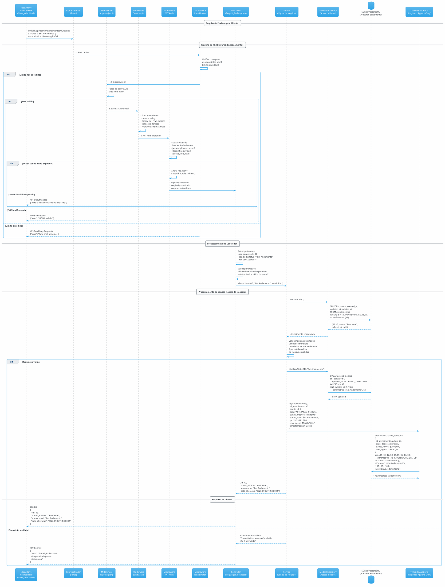
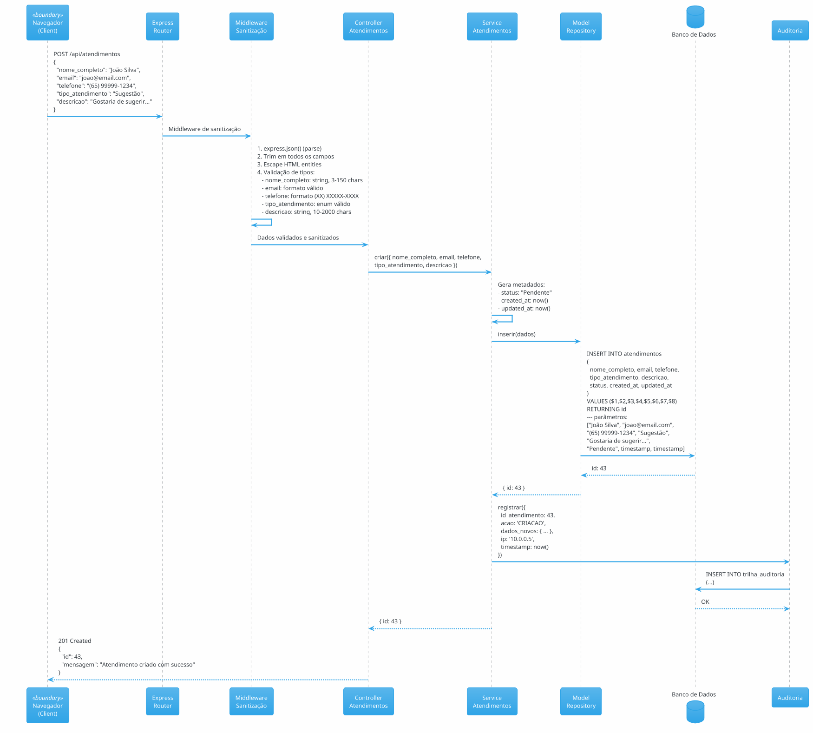
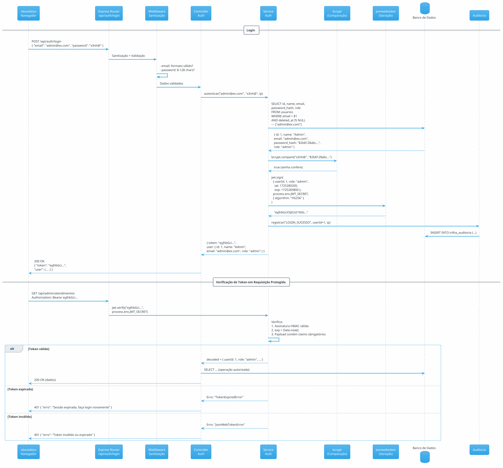
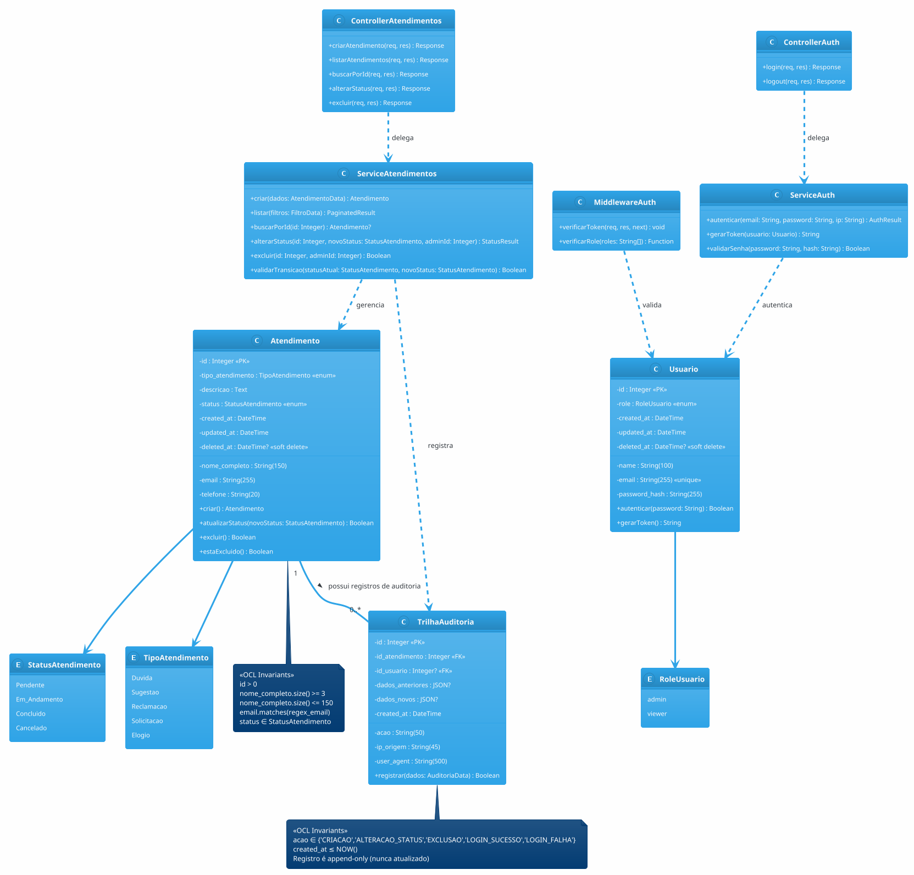

# Requisitos de Sistema — Sistema Focus STT

**Projeto:** Focus STT — Plataforma Full-Stack de Gestão de Atendimentos  
**Normas de Referência:** OMG UML 2.5.1, ISO/IEC/IEEE 29148:2018, ISO/IEC 25010  
**Versão do Documento:** 1.0.0  
**Data de Emissão:** 02/09/2026  
**Classificação:** Documento de Requisitos de Sistema (System Requirements Specification)  
**Stack Tecnológica:** HTML5 Semântico, CSS3, JavaScript Vanilla/ES6+, Node.js, Express, SQLite/PostgreSQL  

---

## Sumário

1. [Requisitos Funcionais de Sistema (RSF)](#1-requisitos-funcionais-de-sistema-rsf)
2. [Requisitos Não Funcionais (RSNF)](#2-requisitos-não-funcionais-rsnf)
3. [Diagramas de Sequência de Backend](#3-diagramas-de-sequência-de-backend)
4. [Diagrama Estrutural de Classes de Domínio com OCL](#4-diagrama-estrutural-de-classes-de-domínio-com-ocl)
5. [Dicionário Técnico de Dados (Esquema Físico DDL)](#5-dicionário-técnico-de-dados-esquema-físico-ddl)
6. [Contratos de API RESTful](#6-contratos-de-api-restful)
7. [Matriz Bidirecional de Rastreabilidade Técnica](#7-matriz-bidirecional-de-rastreabilidade-técnica)

---

## 1. Requisitos Funcionais de Sistema (RSF)

### 1.1 RSF-01: Servidor HTTP Express com Roteamento e Middlewares

| Campo | Valor |
|-------|-------|
| **ID** | RSF-01 |
| **Descrição** | O sistema deve disponibilizar um servidor HTTP baseado no framework Express.js (v4.x ou v5.x) que aceita requisições nas rotas definidas, aplica middlewares de parsing, sanitização, autenticação e tratamento de erros, e responde com payloads JSON estruturados e códigos de status HTTP apropriados. |
| **Rota de Entrada** | `server.js` ou `app.js` |
| **Middlewares do Pipeline** | `express.json()` — parsing de bodies JSON; `cors()` — políticas de origem cruzada; middleware de sanitização global; middleware de autenticação JWT (rotas protegidas); middleware de tratamento de erros centralizado. |
| **Métodos HTTP Suportados** | GET, POST, PATCH, DELETE, OPTIONS |
| **Formato de Payload** | `Content-Type: application/json` |
| **Códigos de Status** | 200 OK, 201 Created, 400 Bad Request, 401 Unauthorized, 403 Forbidden, 404 Not Found, 409 Conflict, 429 Too Many Requests, 500 Internal Server Error |
| **Porta de Escuta** | Configurável via variável de ambiente `PORT` (padrão: 3000) |

**Configuração do Servidor (Pseudocódigo):**

```javascript
// server.js
const express = require('express');
const cors = require('cors');
const { sanitizacaoGlobal } = require('./middlewares/sanitizacao');
const { tratarErros } = require('./middlewares/erros');
const { rateLimiter } = require('./middlewares/rateLimiter');
const rotasPublicas = require('./routes/rotasPublicas');
const rotasAdmin = require('./routes/rotasAdmin');
const rotasAuth = require('./routes/rotasAuth');

const app = express();

// 1. Parsing de body JSON (limite: 10KB)
app.use(express.json({ limit: '10kb' }));

// 2. CORS — apenas origens configuradas
app.use(cors({
  origin: process.env.CORS_ORIGIN || 'http://localhost:3000',
  methods: ['GET', 'POST', 'PATCH', 'DELETE'],
  allowedHeaders: ['Content-Type', 'Authorization']
}));

// 3. Rate Limiting global
app.use(rateLimiter);

// 4. Servir arquivos estáticos (HTML5, CSS, JS client)
app.use(express.static('public', {
  maxAge: '1h',
  etag: true
}));

// 5. Sanitização global de inputs
app.use(sanitizacaoGlobal);

// 6. Rotas
app.use('/api', rotasPublicas);        // Rotas públicas
app.use('/api/auth', rotasAuth);        // Autenticação
app.use('/api/admin', rotasAdmin);      // Rotas protegidas (JWT)

// 7. Tratamento centralizado de erros
app.use(tratarErros);

const PORT = process.env.PORT || 3000;
app.listen(PORT, () => {
  console.log(`Focus STT rodando na porta ${PORT}`);
});
```

### 1.2 RSF-02: Rota POST `/api/atendimentos` — Criação de Atendimento

| Campo | Valor |
|-------|-------|
| **ID** | RSF-02 |
| **Método** | POST |
| **Rota** | `/api/atendimentos` |
| **Autenticação** | Não requerida (rota pública) |
| **Rate Limit** | 5 requisições por minuto por IP |
| **Middleware** | `express.json()`, `sanitizacaoGlobal`, `validarCriacaoAtendimento` |
| **Payload (Request Body)** | `{ "nome_completo": string, "email": string, "telefone": string, "tipo_atendimento": string, "descricao": string }` |
| **Validações** | `nome_completo`: obrigatório, 3-150 chars, sem tags HTML; `email`: obrigatório, formato válido; `telefone`: obrigatório, formato (XX) XXXXX-XXXX ou (XX) XXXX-XXXX; `tipo_atendimento`: obrigatório, enum ["Dúvida", "Sugestão", "Reclamação", "Solicitação", "Elogio"]; `descricao`: obrigatório, 10-2000 chars, sem scripts/tags HTML. |
| **Código de Sucesso** | `201 Created` |
| **Response Body (Sucesso)** | `{ "id": number, "mensagem": "Atendimento criado com sucesso" }` |
| **Códigos de Erro** | `400 Bad Request` — dados inválidos; `429 Too Many Requests` — rate limit excedido; `500 Internal Server Error` — falha interna |

**Pseudocódigo do Controller:**

```javascript
// controllers/atendimentoController.js
async function criarAtendimento(req, res, next) {
  try {
    const { nome_completo, email, telefone, tipo_atendimento, descricao } = req.body;

    // Validação server-side (express-validator ou manual)
    const erros = validarDadosCriacao({ nome_completo, email, telefone, tipo_atendimento, descricao });
    if (erros.length > 0) {
      return res.status(400).json({ erros });
    }

    // Inserção via Prepared Statement
    const resultado = await AtendimentoService.criar({
      nome_completo, email, telefone, tipo_atendimento, descricao,
      status: 'Pendente',
      created_at: new Date().toISOString()
    });

    return res.status(201).json({
      id: resultado.id,
      mensagem: 'Atendimento criado com sucesso'
    });
  } catch (erro) {
    next(erro);
  }
}
```

### 1.3 RSF-03: Rota POST `/api/auth/login` — Autenticação Administrativa

| Campo | Valor |
|-------|-------|
| **ID** | RSF-03 |
| **Método** | POST |
| **Rota** | `/api/auth/login` |
| **Autenticação** | Não requerida (é o endpoint de obtenção de token) |
| **Rate Limit** | 10 tentativas por minuto por IP |
| **Middleware** | `express.json()`, `sanitizacaoGlobal`, `validarLogin` |
| **Payload** | `{ "email": string, "password": string }` |
| **Validações** | `email`: obrigatório, formato válido; `password`: obrigatório, 8-128 chars |
| **Código de Sucesso** | `200 OK` |
| **Response Body (Sucesso)** | `{ "token": string (JWT), "user": { "id": number, "name": string, "email": string, "role": string } }` |
| **Códigos de Erro** | `400 Bad Request` — campos faltando; `401 Unauthorized` — credenciais inválidas; `429 Too Many Requests` — tentativas excedidas; `500 Internal Server Error` — falha interna |

**Pseudocódigo do Service:**

```javascript
// services/authService.js
const bcrypt = require('bcrypt');
const jwt = require('jsonwebtoken');

async function autenticar(email, password, ip) {
  // 1. Buscar usuário por e-mail (Prepared Statement)
  const usuario = await db.query(
    'SELECT id, name, email, password_hash, role FROM usuarios WHERE email = $1 AND deleted_at IS NULL',
    [email]
  );

  if (!usuario) {
    await registrarAuditoria(null, 'LOGIN_FALHA', email, ip);
    throw new ErroAutenticacao('E-mail ou senha incorretos');
  }

  // 2. Comparação timing-safe da senha com hash bcrypt
  const senhaValida = await bcrypt.compare(password, usuario.password_hash);
  if (!senhaValida) {
    await registrarAuditoria(usuario.id, 'LOGIN_FALHA', email, ip);
    throw new ErroAutenticacao('E-mail ou senha incorretos');
  }

  // 3. Geração de JWT
  const payload = {
    userId: usuario.id,
    role: usuario.role,
    iat: Math.floor(Date.now() / 1000),
    exp: Math.floor(Date.now() / 1000) + (parseInt(process.env.JWT_EXPIRATION) || 3600)
  };

  const token = jwt.sign(payload, process.env.JWT_SECRET, { algorithm: 'HS256' });

  // 4. Registrar sucesso na auditoria
  await registrarAuditoria(usuario.id, 'LOGIN_SUCESSO', email, ip);

  return {
    token,
    user: {
      id: usuario.id,
      name: usuario.name,
      email: usuario.email,
      role: usuario.role
    }
  };
}
```

### 1.4 RSF-04: Rota GET `/api/admin/atendimentos` — Listagem de Atendimentos

| Campo | Valor |
|-------|-------|
| **ID** | RSF-04 |
| **Método** | GET |
| **Rota** | `/api/admin/atendimentos` |
| **Autenticação** | Requerida (`Authorization: Bearer <JWT>`) |
| **Role Required** | `admin` |
| **Query Parameters** | `page` (default: 1), `limit` (default: 10, max: 50), `status` (filtro opcional), `tipo` (filtro opcional), `order` (default: `desc`), `orderBy` (default: `created_at`) |
| **Código de Sucesso** | `200 OK` |
| **Response Body** | `{ "data": Array<Atendimento>, "pagination": { "page": number, "limit": number, "total": number, "totalPages": number } }` |
| **Códigos de Erro** | `401 Unauthorized` — token ausente/inválido; `403 Forbidden` — role insuficiente; `500 Internal Server Error` |

### 1.5 RSF-05: Rota GET `/api/admin/atendimentos/:id` — Detalhes do Atendimento

| Campo | Valor |
|-------|-------|
| **ID** | RSF-05 |
| **Método** | GET |
| **Rota** | `/api/admin/atendimentos/:id` |
| **Autenticação** | Requerida (`Authorization: Bearer <JWT>`) |
| **Role Required** | `admin` |
| **Parâmetro de Rota** | `id` (integer, obrigatório) |
| **Código de Sucesso** | `200 OK` |
| **Response Body** | Objeto `Atendimento` completo com campos: `id`, `nome_completo`, `email`, `telefone`, `tipo_atendimento`, `descricao`, `status`, `created_at`, `updated_at` |
| **Códigos de Erro** | `401 Unauthorized`; `403 Forbidden`; `404 Not Found` — ID inexistente; `500 Internal Server Error` |

### 1.6 RSF-06: Rota PATCH `/api/admin/atendimentos/:id/status` — Alteração de Status

| Campo | Valor |
|-------|-------|
| **ID** | RSF-06 |
| **Método** | PATCH |
| **Rota** | `/api/admin/atendimentos/:id/status` |
| **Autenticação** | Requerida (`Authorization: Bearer <JWT>`) |
| **Role Required** | `admin` |
| **Parâmetro de Rota** | `id` (integer, obrigatório) |
| **Payload** | `{ "status": string }` |
| **Validações** | `status`: obrigatório, um dos valores do enum `status_atendimento` |
| **Máquina de Estados** | Pendente → Em Andamento, Cancelado; Em Andamento → Concluído, Cancelado |
| **Código de Sucesso** | `200 OK` |
| **Response Body (Sucesso)** | `{ "id": number, "status_anterior": string, "status_novo": string, "data_alteracao": string (ISO 8601) }` |
| **Códigos de Erro** | `400 Bad Request` — status inválido; `401 Unauthorized`; `403 Forbidden`; `404 Not Found`; `409 Conflict` — transição não permitida; `500 Internal Server Error` |

### 1.7 RSF-07: Rota DELETE `/api/admin/atendimentos/:id` — Exclusão de Atendimento

| Campo | Valor |
|-------|-------|
| **ID** | RSF-07 |
| **Método** | DELETE |
| **Rota** | `/api/admin/atendimentos/:id` |
| **Autenticação** | Requerida (`Authorization: Bearer <JWT>`) |
| **Role Required** | `admin` |
| **Parâmetro de Rota** | `id` (integer, obrigatório) |
| **Comportamento** | Soft delete: `UPDATE atendimentos SET deleted_at = CURRENT_TIMESTAMP WHERE id = $1` |
| **Código de Sucesso** | `200 OK` |
| **Response Body (Sucesso)** | `{ "id": number, "mensagem": "Atendimento excluído com sucesso" }` |
| **Códigos de Erro** | `401 Unauthorized`; `403 Forbidden`; `404 Not Found`; `500 Internal Server Error` |

### 1.8 RSF-08: Middleware de Autenticação JWT

| Campo | Valor |
|-------|-------|
| **ID** | RSF-08 |
| **Descrição** | Middleware Express que intercepta requisições a rotas protegidas, extrai o token JWT do cabeçalho `Authorization: Bearer <token>`, valida a assinatura, verifica expiração e decodifica o payload. Se válido, anexa `req.user` com os dados do usuário decodificado. Se inválido, retorna 401 sem expor detalhes do erro. |
| **Localização** | `middlewares/auth.js` |
| **Algoritmo de Assinatura** | HS256 (HMAC-SHA256) |
| **Chave Secreta** | `process.env.JWT_SECRET` (mínimo 256 bits) |
| **Claims Obrigatórias** | `userId`, `role`, `iat`, `exp` |
| **Comportamento em Erro** | Token ausente → 401 `{ "erro": "Token de autenticação necessário" }`; Token inválido → 401 `{ "erro": "Token inválido ou expirado" }`; Token expirado → 401 `{ "erro": "Sessão expirada, faça login novamente" }` |

### 1.9 RSF-09: Middleware de Sanitização de Dados de Entrada

| Campo | Valor |
|-------|-------|
| **ID** | RSF-09 |
| **Descrição** | Middleware Express que processa todos os campos string do `req.body` e `req.query`, removendo tags HTML, scripts inline, atributos perigosos (`on*`, `javascript:`, `data:`) e normalizando caracteres Unicode. Utiliza estratégia de defesa em profundidade (express-validator + escape manual + sanitização de objetos). |
| **Localização** | `middlewares/sanitizacao.js` |
| **Bibliotecas** | `express-validator` (validação), `xss` (escaping), `validator` (normalização) |
| **Estratégia** | (a) Trim em todos os campos string; (b) Escape de entidades HTML (`<`, `>`, `&`, `"`, `'`); (c) Remoção de tags HTML via regex; (d) Validação de tipos primitivos; (e) Profundidade máxima de objetos: 5 níveis; (f) Tamanho máximo de string: 10.000 caracteres |

### 1.10 RSF-10: Middleware de Rate Limiting

| Campo | Valor |
|-------|-------|
| **ID** | RSF-10 |
| **Descrição** | Middleware Express que controla a taxa de requisições por IP para prevenir abuso e ataques de força bruta. Implementa estratégia sliding window com armazenamento em memória (produção: Redis). |
| **Localização** | `middlewares/rateLimiter.js` |
| **Configuração Global** | 100 requisições por 15 minutos por IP |
| **Configuração Login** | 10 tentativas por 15 minutos por IP |
| **Configuração Criação** | 5 requisições por minuto por IP |
| **Resposta em Limite** | `429 Too Many Requests` `{ "erro": "Muitas requisições. Tente novamente em {tempo} segundos." }` |

---

## 2. Requisitos Não Funcionais (RSNF)

### 2.1 Taxonomia FURPS+ / ISO/IEC 25010

#### 2.1.1 Segurança (ISO 25010 — Segurança da Informação)

| ID | Requisito | Especificação Técnica |
|----|-----------|----------------------|
| **RSNF-SEG-01** | Criptografia de Senhas | Senhas de administradores devem ser armazenadas com hash unidirecional usando **bcrypt** com fator de custo mínimo 12 (`bcrypt.hash(password, 12)`) ou **argon2id** com parâmetros: memory=65536KB, iterations=3, parallelism=4. NUNCA armazenar senhas em texto claro. Fallback para **PBKDF2** com 100.000 iterações SHA-256 e salt aleatório de 16 bytes se bcrypt/argon2 indisponível. |
| **RSNF-SEG-02** | Autenticação Stateless via JWT | Sessões são gerenciadas via **JSON Web Token (JWT)** no padrão RFC 7519. Token transmitido via cabeçalho `Authorization: Bearer <token>` ou cookie HTTP-Only com `Secure`, `SameSite=Strict` e `HttpOnly`. Payload contém: `userId`, `role`, `iat`, `exp`. Algoritmo: HS256 (HMAC-SHA256) com chave secreta de no mínimo 256 bits. Token expira em 1 hora (configurável via `JWT_EXPIRATION`). |
| **RSNF-SEG-03** | Autorização Baseada em Papéis (RBAC) | Controle de acesso baseado em função (Role-Based Access Control). Roles definidas: `admin` (acesso total), `viewer` (somente leitura). Middleware de autorização verifica `req.user.role` contra a lista de roles permitidas por rota. |
| **RSNF-SEG-04** | Proteção contra XSS (Cross-Site Scripting) | **Defesa em profundidade:** (a) Client-side: DOMPurify para sanitização de DOM; (b) Server-side: express-validator + xss library; (c) Headers HTTP: `Content-Security-Policy` com `default-src 'self'; script-src 'self'; style-src 'self' 'unsafe-inline'; img-src 'self' data:; font-src 'self';` (d) `X-Content-Type-Options: nosniff`; (e) `X-XSS-Protection: 1; mode=block` (compatibilidade legacy). |
| **RSNF-SEG-05** | Proteção contra SQL Injection | **TODAS** as queries ao banco devem usar **Prepared Statements** com parâmetros posicionais (`$1`, `$2`, ..., no PostgreSQL) ou nomeados (`:nome`, no Oracle). NUNCA concatenar strings de entrada do usuário em queries SQL. Utilizar query builder (Knex.js, Objection.js) ou ORM (Sequelize, TypeORM) como camada adicional de proteção. |
| **RSNF-SEG-06** | Proteção contra CSRF | Token CSRF gerado e validado em requisições de estado-modificação (POST, PATCH, DELETE). Implementação via double-submit cookie pattern ou header customizado `X-CSRF-Token`. |
| **RSNF-SEG-07** | Headers de Segurança HTTP | Aplicar via `helmet.js`: `Strict-Transport-Security: max-age=31536000; includeSubDomains`; `X-Frame-Options: DENY`; `X-Content-Type-Options: nosniff`; `Referrer-Policy: strict-origin-when-cross-origin`; `Permissions-Policy: camera=(), microphone=(), geolocation=()`. |
| **RSNF-SEG-08** | Registro de Auditoria | Toda ação de_CREATE, UPDATE, DELETE e LOGIN_FALHA deve gerar registro na tabela `trilha_auditoria` com: `id_usuario`, `acao`, `dados_anteriores` (JSON), `dados_novos` (JSON), `ip_origem`, `user_agent`, `timestamp`. Registros de auditoria são **append-only** (nunca atualizados ou excluídos). |

#### 2.1.2 Performance (ISO 25010 — Eficiência de Desempenho)

| ID | Requisito | Especificação Técnica |
|----|-----------|----------------------|
| **RSNF-PER-01** | Tempo de Resposta da API | 95% das requisições da API devem responder em até **200ms** (P95) sob carga normal (até 50 requisições concorrentes). Tempo máximo absoluto: **2 segundos** (P99). |
| **RSNF-PER-02** | Tempo de Renderização do Frontend | O Time to Interactive (TTI) da página inicial deve ser inferior a **1.5 segundos** em conexão 3G simulada. First Contentful Paint (FCP) deve ocorrer em até **800ms**. |
| **RSNF-PER-03** | Throughput da API | O sistema deve suportar no mínimo **100 requisições por segundo** (RPS) com tempo de resposta médio inferior a 100ms em hardware padrão (2 vCPU, 4GB RAM). |
| **RSNF-PER-04** | Tamanho do Payload | Respostas da API devem ter payload mínimo. Campos desnecessários não devem ser retornados (princípio de seleção mínima). Payload máximo de request: 10KB. |
| **RSNF-PER-05** | Otimização de Banco de Dados | Queries frequentes devem utilizar **índices** apropriados. Tempo médio de query deve ser inferior a **10ms** para operações pontuais (SELECT por PK) e inferior a **50ms** para operações de listagem com paginação. |

#### 2.1.3 Confiabilidade (ISO 25010 — Confiabilidade)

| ID | Requisito | Especificação Técnica |
|----|-----------|----------------------|
| **RSNF-CON-01** | Disponibilidade | O sistema deve estar disponível em **99,5%** do tempo mensurado (downtime máximo de ~3.6 horas/mês para manutenção programada). |
| **RSNF-CON-02** | Tratamento de Erros | Erros não tratados no Event Loop não devem causar crash do processo. Utilizar `process.on('uncaughtException')` e `process.on('unhandledRejection')` com logging e graceful shutdown. |
| **RSNF-CON-03** | Transacionalidade ACID | Operações de escrita no banco (INSERT, UPDATE) devem ser atômicas. Operações que envolvem múltiplas tabelas devem usar transações (`BEGIN ... COMMIT / ROLLBACK`). |
| **RSNF-CON-04** | Recuperabilidade | Dados persistidos devem ser recuperáveis após reinício do servidor. O banco SQLite/PostgreSQL garante persistência em disco. Backup automático diário do banco (cron job ou migration script). |
| **RSNF-CON-05** | Idempotência de Exclusão | A operação DELETE deve ser idempotente: excluir um registro já excluído deve retornar 404 (não erro 500). Soft delete com `deleted_at` previne reprocessamento. |
| **RSNF-CON-06** | Graceful Shutdown | O servidor deve encerrar conexões pendentes e fechar o pool de conexões do banco antes de encerrar o processo (`SIGTERM`/`SIGINT` handlers). |

#### 2.1.4 Usabilidade (ISO 25010 — Usabilidade)

| ID | Requisito | Especificação Técnica |
|----|-----------|----------------------|
| **RSNF-USA-01** | Acessibilidade WCAG 2.1 AA | Formulários devem seguir WCAG 2.1 nível AA: contraste mínimo 4.5:1; labels associados a inputs; navegação por teclado; atributos `aria-label` e `aria-describedby`; `role` semântico. |
| **RSNF-USA-02** | Feedback Visual (Toast) | Todas as operações de sucesso ou falha devem exibir feedback via componente toast/DOM persistente por 3-5 segundos, posicionado no canto superior direito. |
| **RSNF-USA-03** | Responsividade | Layouts HTML5 devem ser responsivos usando Media Queries CSS3. Breakpoints: mobile (< 576px), tablet (576-992px), desktop (> 992px). |
| **RSNF-USA-04** | Mensagens de Erro Descritivas | Mensagens de erro devem ser específicas e acionáveis. Ex: "O campo 'E-mail' deve conter um endereço válido (exemplo@dominio.com)". |

#### 2.1.5 Arquitetura e Manutenibilidade (ISO 25010 — Manutenibilidade)

| ID | Requisito | Especificação Técnica |
|----|-----------|----------------------|
| **RSNF-ARC-01** | Arquitetura em Camadas | O backend deve seguir arquitetura em camadas: **Rotas** → **Middlewares** → **Controllers** → **Services** → **Models/Repositories** → **Database**. Cada camada tem responsabilidade única e depende apenas da camada inferior. |
| **RSNF-ARC-02** | Separação de Responsabilidades | Controllers orquestram fluxo (request/response). Services contêm lógica de negócio. Models/Repositories encapsulam acesso a dados. Middlewares tratam cross-cutting concerns (auth, sanitização, logging). |
| **RSNF-ARC-03** | Não-Bloqueio do Event Loop | Operações de I/O (queries ao banco, leitura de arquivos, chamadas HTTP externas) devem ser assíncronas (Promise/async-await). NUNCA bloquear o Event Loop com operações síncronas pesadas (`fs.readFileSync`, loops complexos síncronos). |
| **RSNF-ARC-04** | Gerenciamento de Pool de Conexões | O banco de dados deve ser acessado via pool de conexões configurado com: `min: 2`, `max: 10` (configurável), `idleTimeoutMillis: 30000`, `connectionTimeoutMillis: 2000`. |
| **RSNF-ARC-05** | Estrutura de Diretórios | O projeto deve seguir a estrutura: `/public` (HTML5, CSS, JS client); `/server` (Node.js backend); `/server/routes`; `/server/controllers`; `/server/services`; `/server/models`; `/server/middlewares`; `/server/config`; `/server/utils`; `/migrations`; `/seeds`. |
| **RSNF-ARC-06** | Versionamento de API | Rotas devem sufixar `/api/v1/...` para permitir versionamento futuro sem quebra de contratos existentes. |
| **RSNF-ARC-07** | Variáveis de Ambiente | Todas as configurações sensíveis e variáveis devem estar em arquivo `.env` (não versionado). Utilizar `dotenv` para carregamento. Exigir `.env.example` no repositório com valores dummy. |
| **RSNF-ARC-08** | Consistência de Codificação | Seguir padrão de codificação: indentação 2 espaços; nomes camelCase para variáveis/funções; PascalCase para classes/constructors; kebab-case para arquivos; extensão `.js` para módulos CommonJS, `.mjs` para ES Modules. |

---

## 3. Diagramas de Sequência de Backend

### 3.1 DS Backend: Fluxo Completo — Rota Express → Middlewares → Controller → Service → Banco → Auditoria



### 3.2 DS Backend: Fluxo de Criação de Atendimento (Rota Pública)



### 3.3 DS Backend: Fluxo de Autenticação e Verificação de Token



---

## 4. Diagrama Estrutural de Classes de Domínio com OCL

### 4.1 Diagrama de Classes (PlantUML)



### 4.2 Invariantes OCL (Object Constraint Language)

#### Invariantes de Classe `Atendimento`

```ocl
-- Invariante INV-ATD-01: O identificador deve ser positivo
context Atendimento
inv INV-ATD-01: self.id > 0

-- Invariante INV-ATD-02: Nome completo deve ter entre 3 e 150 caracteres
context Atendimento
inv INV-ATD-02: self.nome_completo.size() >= 3 and self.nome_completo.size() <= 150

-- Invariante INV-ATD-03: E-mail deve seguir formato válido
context Atendimento
inv INV-ATD-03: self.email.matches('[a-zA-Z0-9._%+-]+@[a-zA-Z0-9.-]+\.[a-zA-Z]{2,}')

-- Invariante INV-ATD-04: Telefone deve seguir formato brasileiro
context Atendimento
inv INV-ATD-04: self.telefone.matches('\(\d{2}\)\s?\d{4,5}-\d{4}')

-- Invariante INV-ATD-05: Tipo de atendimento deve ser um valor válido do enum
context Atendimento
inv INV-ATD-05: self.tipo_atendimento = TipoAtendimento.allInstances().includes(self.tipo_atendimento)

-- Invariante INV-ATD-06: Descrição deve ter entre 10 e 2000 caracteres
context Atendimento
inv INV-ATD-06: self.descricao.size() >= 10 and self.descricao.size() <= 2000

-- Invariante INV-ATD-07: Status deve ser um valor válido do enum
context Atendimento
inv INV-ATD-07: self.status = StatusAtendimento.allInstances().includes(self.status)

-- Invariante INV-ATD-08: created_at não pode ser posterior a updated_at
context Atendimento
inv INV-ATD-08: self.created_at <= self.updated_at

-- Invariante INV-ATD-09: deleted_at, se definido, deve ser posterior a created_at
context Atendimento
inv INV-ATD-09: self.deleted_at.isDefined() implies self.deleted_at >= self.created_at
```

#### Invariantes de Classe `TrilhaAuditoria`

```ocl
-- Invariante INV-AUD-01: Ação deve ser um valor válido
context TrilhaAuditoria
inv INV-AUD-01: self.acao = 'CRIACAO' or self.acao = 'ALTERACAO_STATUS'
               or self.acao = 'EXCLUSAO' or self.acao = 'LOGIN_SUCESSO'
               or self.acao = 'LOGIN_FALHA'

-- Invariante INV-AUD-02: Timestamp não pode ser futuro
context TrilhaAuditoria
inv INV-AUD-02: self.created_at <= SystemDate.now()

-- Invariante INV-AUD-03: Append-only (dados anteriores não podem ser modificados)
context TrilhaAuditoria
inv INV-AUD-03: self.id.isNew() implies true  -- INSERT permitido
-- UPDATE e DELETE são proibidos por política de sistema (não modelado em OCL)
```

#### Invariantes de Classe `Usuario`

```ocl
-- Invariante INV-USR-01: E-mail deve ser único entre usuários ativos
context Usuario
inv INV-USR-01: Usuario.allInstances()
   ->select(u | u.email = self.email and u.deleted_at = null)
   ->size() <= 1

-- Invariante INV-USR-02: Password hash não pode ser vazio
context Usuario
inv INV-USR-02: self.password_hash.size() > 0

-- Invariante INV-USR-03: Role deve ser um valor válido
context Usuario
inv INV-USR-03: self.role = 'admin' or self.role = 'viewer'
```

#### Regras de Transição de Status (Máquina de Estados — OCL)

```ocl
-- Transições permitidas para StatusAtendimento
context ServiceAtendimentos::validarTransicao(
  statusAtual: StatusAtendimento,
  novoStatus: StatusAtendimento
): Boolean

-- INV-TRANS-01: Transições Permitidas
-- Pendente → Em Andamento: PERMITIDA
-- Pendente → Cancelado: PERMITIDA
-- Em Andamento → Concluído: PERMITIDA
-- Em Andamento → Cancelado: PERMITIDA
-- Concluído → (qualquer): PROIBIDA
-- Cancelado → (qualquer): PROIBIDA
-- Pendente → Concluído: PROIBIDA (pular etapas)
-- Em Andamento → Pendente: PROIBIDA (retrocesso)
-- (qualquer) → (mesmo status): PROIBIDA (sem mudança)

context ServiceAtendimentos
inv INV-TRANS-01:
  let transicoesPermitidas = Set{Tupla('Pendente','Em Andamento'),
                                 Tupla('Pendente','Cancelado'),
                                 Tupla('Em Andamento','Concluido'),
                                 Tupla('Em Andamento','Cancelado')} in
  transicoesPermitidas.includes(Tupla(statusAtual, novoStatus))

-- INV-TRANS-02: Status Concluído é absorvente (não pode ser alterado)
context ServiceAtendimentos
inv INV-TRANS-02:
  statusAtual = 'Concluido' implies
    not ServiceAtendimentos.transicoesPermitidas()
      ->exists(t | t.origem = statusAtual)

-- INV-TRANS-03: Status Cancelado é absorvente
context ServiceAtendimentos
inv INV-TRANS-03:
  statusAtual = 'Cancelado' implies
    not ServiceAtendimentos.transicoesPermitidas()
      ->exists(t | t.origem = statusAtual)
```

---

## 5. Dicionário Técnico de Dados (Esquema Físico DDL)

### 5.1 Tabela `atendimentos`

```sql
-- =============================================
-- Tabela: atendimentos
-- Descrição: Armazena os atendimentos registrados
-- pelo formulário público e gerenciados pelo admin.
-- =============================================

CREATE TABLE IF NOT EXISTS atendimentos (
    id              INTEGER PRIMARY KEY AUTOINCREMENT,
                                          -- SQLite: AUTOINCREMENT
                                          -- PostgreSQL: SERIAL ou GENERATED ALWAYS AS IDENTITY

    nome_completo   VARCHAR(150)          -- Nome completo do solicitante
                    NOT NULL              -- Campo obrigatório
                    CHECK (length(nome_completo) >= 3
                       AND length(nome_completo) <= 150),

    email           VARCHAR(255)          -- E-mail do solicitante
                    NOT NULL              -- Campo obrigatório
                    CHECK (email LIKE '%_@_%.__%'),  -- Validação básica de formato

    telefone        VARCHAR(20)           -- Telefone no formato (XX) XXXXX-XXXX
                    NOT NULL              -- Campo obrigatório
                    CHECK (telefone ~ '^\(\d{2}\)\s?\d{4,5}-\d{4}$'),
                                          -- PostgreSQL: regex
                                          -- SQLite: CHECK básico ou app-level

    tipo_atendimento VARCHAR(20)          -- Tipo/classificação do atendimento
                     NOT NULL             -- Campo obrigatório
                     CHECK (tipo_atendimento IN (
                         'Duvida',
                         'Sugestao',
                         'Reclamacao',
                         'Solicitacao',
                         'Elogio'
                     )),

    descricao       TEXT                  -- Descrição detalhada do atendimento
                    NOT NULL              -- Campo obrigatório
                    CHECK (length(descricao) >= 10
                       AND length(descricao) <= 2000),

    status          VARCHAR(20)           -- Status atual do atendimento
                    NOT NULL              -- Campo obrigatório
                    DEFAULT 'Pendente'    -- Status inicial ao criar
                    CHECK (status IN (
                        'Pendente',
                        'Em Andamento',
                        'Concluido',
                        'Cancelado'
                    )),

    created_at      DATETIME              -- Data/hora de criação do registro
                    NOT NULL              -- Campo obrigatório
                    DEFAULT CURRENT_TIMESTAMP,

    updated_at      DATETIME              -- Data/hora da última atualização
                    NOT NULL              -- Campo obrigatório
                    DEFAULT CURRENT_TIMESTAMP,

    deleted_at      DATETIME              -- Data/hora da exclusão lógica (soft delete)
                    DEFAULT NULL          -- NULL = registro ativo
);

-- =============================================
-- Índices de Performance
-- =============================================

-- Índice para busca por status (filtros frequentes)
CREATE INDEX IF NOT EXISTS idx_atendimentos_status
    ON atendimentos(status)
    WHERE deleted_at IS NULL;
    -- PostgreSQL: índice parcial (WHERE deleted_at IS NULL)
    -- SQLite: índice completo (WHERE suportado a partir do 3.8.0)

-- Índice para ordenação por data de criação (listagem)
CREATE INDEX IF NOT EXISTS idx_atendimentos_created_at
    ON atendimentos(created_at DESC)
    WHERE deleted_at IS NULL;

-- Índice para busca por tipo de atendimento
CREATE INDEX IF NOT EXISTS idx_atendimentos_tipo
    ON atendimentos(tipo_atendimento)
    WHERE deleted_at IS NULL;

-- Índice único parcial para soft delete (evita duplicatas ativas)
-- PostgreSQL:
CREATE UNIQUE INDEX IF NOT EXISTS idx_atendimentos_unique_email_ativo
    ON atendimentos(email, created_at)
    WHERE deleted_at IS NULL;
```

### 5.2 Tabela `usuarios`

```sql
-- =============================================
-- Tabela: usuarios
-- Descrição: Armazena os administradores do sistema
-- com credenciais para acesso ao painel.
-- =============================================

CREATE TABLE IF NOT EXISTS usuarios (
    id              INTEGER PRIMARY KEY AUTOINCREMENT,

    name            VARCHAR(100)          -- Nome completo do usuário
                    NOT NULL
                    CHECK (length(name) >= 2 AND length(name) <= 100),

    email           VARCHAR(255)          -- E-mail de login (único)
                    NOT NULL
                    UNIQUE
                    CHECK (email LIKE '%_@_%.__%'),

    password_hash   VARCHAR(255)          -- Hash da senha (bcrypt/argon2)
                    NOT NULL
                    CHECK (length(password_hash) >= 60),
                    -- bcrypt gera hashes de 60 caracteres

    role            VARCHAR(10)           -- Papel do usuário no sistema
                    NOT NULL
                    DEFAULT 'admin'
                    CHECK (role IN ('admin', 'viewer')),

    created_at      DATETIME
                    NOT NULL
                    DEFAULT CURRENT_TIMESTAMP,

    updated_at      DATETIME
                    NOT NULL
                    DEFAULT CURRENT_TIMESTAMP,

    deleted_at      DATETIME
                    DEFAULT NULL
);

-- Índice para busca por e-mail (autenticação)
CREATE UNIQUE INDEX IF NOT EXISTS idx_usuarios_email
    ON usuarios(email)
    WHERE deleted_at IS NULL;
```

### 5.3 Tabela `trilha_auditoria`

```sql
-- =============================================
-- Tabela: trilha_auditoria
-- Descrição: Registra todas as ações realizadas
-- no sistema (append-only). Nunca é atualizada
-- ou excluída.
-- =============================================

CREATE TABLE IF NOT EXISTS trilha_auditoria (
    id                INTEGER PRIMARY KEY AUTOINCREMENT,

    id_atendimento    INTEGER             -- Referência ao atendimento afetado
                      NOT NULL
                      REFERENCES atendimentos(id)
                      ON DELETE RESTRICT,
                      -- Impede exclusão de atendimento com registros
                      -- de auditoria vinculados

    id_usuario        INTEGER             -- Referência ao usuário que realizou
                                          -- a ação (NULL para ações anônimas)
                      REFERENCES usuarios(id)
                      ON DELETE SET NULL,

    acao              VARCHAR(50)         -- Tipo de ação realizada
                      NOT NULL
                      CHECK (acao IN (
                          'CRIACAO',
                          'ALTERACAO_STATUS',
                          'EXCLUSAO',
                          'LOGIN_SUCESSO',
                          'LOGIN_FALHA'
                      )),

    dados_anteriores  TEXT                -- JSON com dados antes da alteração
                      DEFAULT NULL,       -- NULL para CREATE e LOGIN

    dados_novos       TEXT                -- JSON com dados depois da alteração
                      DEFAULT NULL,       -- NULL para DELETE e LOGIN_FALHA

    ip_origem         VARCHAR(45)         -- Endereço IP de origem
                      NOT NULL,           -- Suporta IPv4 e IPv6

    user_agent        VARCHAR(500)        -- String do User-Agent do cliente
                      DEFAULT 'Desconhecido',

    created_at        DATETIME            -- Timestamp do registro (append-only)
                      NOT NULL
                      DEFAULT CURRENT_TIMESTAMP
);

-- Índices para consultas de auditoria
CREATE INDEX IF NOT EXISTS idx_auditoria_atendimento
    ON trilha_auditoria(id_atendimento);

CREATE INDEX IF NOT EXISTS idx_auditoria_usuario
    ON trilha_auditoria(id_usuario)
    WHERE id_usuario IS NOT NULL;

CREATE INDEX IF NOT EXISTS idx_auditoria_acao
    ON trilha_auditoria(acao);

CREATE INDEX IF NOT EXISTS idx_auditoria_timestamp
    ON trilha_auditoria(created_at DESC);

-- =============================================
-- Regras de Integridade Adicionais
-- =============================================

-- Trilha de auditoria é append-only:
-- Nenhum UPDATE ou DELETE é permitido nesta tabela.
-- Deve ser aplicado via trigger (PostgreSQL) ou
-- permissão de GRANT apenas INSERT.
-- PostgreSQL:
-- REVOKE UPDATE, DELETE ON trilha_auditoria FROM PUBLIC;
-- GRANT INSERT ON trilha_auditoria TO app_user;
-- GRANT SELECT ON trilha_auditoria TO app_user;
```

### 5.4 Dados Iniciais (Seed)

```sql
-- =============================================
-- Inserção de dados iniciais (seed)
-- =============================================

-- Administrador padrão (senha: admin123456 — deve ser alterada em produção)
-- Hash gerado com bcrypt (custo 12):
INSERT INTO usuarios (name, email, password_hash, role)
VALUES (
    'Administrador',
    'admin@focussstt.com',
    '$2b$12$LJ3m4ys3Lk0TSwEHQg5KjuhJdJ3YJ3YJ3YJ3YJ3YJ3YJ3YJ3Y',  -- Hash placeholder
    'admin'
);
```

---

## 6. Contratos de API RESTful

### 6.1 Rotas Públicas

| Método | Rota | Descrição | Autenticação | Rate Limit | Request Body | Response (Sucesso) | Response (Erro) |
|--------|------|-----------|-------------|------------|-------------|-------------------|-----------------|
| **GET** | `/` | Serve a página HTML5 do formulário público | Não | — | — | `200 OK` (HTML) | `500 Internal Server Error` |
| **GET** | `/api/health` | Health check do sistema | Não | — | — | `200 OK` `{ "status": "healthy", "uptime": number }` | — |
| **POST** | `/api/atendimentos` | Cria novo atendimento via formulário público | Não | 5/min por IP | `{ "nome_completo": string, "email": string, "telefone": string, "tipo_atendimento": string, "descricao": string }` | `201 Created` `{ "id": number, "mensagem": string }` | `400 Bad Request` `{ "erros": Array }` ; `429 Too Many Requests` ; `500 Internal Server Error` |

### 6.2 Rotas de Autenticação

| Método | Rota | Descrição | Autenticação | Rate Limit | Request Body | Response (Sucesso) | Response (Erro) |
|--------|------|-----------|-------------|------------|-------------|-------------------|-----------------|
| **POST** | `/api/auth/login` | Autentica administrador e retorna JWT | Não | 10/15min por IP | `{ "email": string, "password": string }` | `200 OK` `{ "token": string, "user": { "id": number, "name": string, "email": string, "role": string } }` | `400 Bad Request` ; `401 Unauthorized` `{ "erro": string }` ; `429 Too Many Requests` |
| **POST** | `/api/auth/logout` | Encerra sessão (invalidação client-side) | Sim (JWT) | — | — | `200 OK` `{ "mensagem": "Logout realizado com sucesso" }` | `401 Unauthorized` |
| **GET** | `/api/auth/me` | Retorna dados do usuário autenticado | Sim (JWT) | — | — | `200 OK` `{ "user": { "id": number, "name": string, "email": string, "role": string } }` | `401 Unauthorized` |

### 6.3 Rotas Administrativas Protegidas

| Método | Rota | Descrição | Autenticação | Role | Rate Limit | Request | Response (Sucesso) | Response (Erro) |
|--------|------|-----------|-------------|------|------------|---------|-------------------|-----------------|
| **GET** | `/api/admin/atendimentos` | Lista atendimentos com paginação e filtros | JWT | admin | 100/15min | Query: `page`, `limit`, `status`, `tipo`, `order`, `orderBy` | `200 OK` `{ "data": [...], "pagination": {...} }` | `401` ; `403` ; `500` |
| **GET** | `/api/admin/atendimentos/:id` | Busca atendimento por ID | JWT | admin | 100/15min | — | `200 OK` `{ Atendimento completo }` | `401` ; `403` ; `404` ; `500` |
| **PATCH** | `/api/admin/atendimentos/:id/status` | Altera status do atendimento | JWT | admin | 100/15min | `{ "status": string }` | `200 OK` `{ "id": number, "status_anterior": string, "status_novo": string, "data_alteracao": string }` | `400` ; `401` ; `403` ; `404` ; `409 Conflict` ; `500` |
| **DELETE** | `/api/admin/atendimentos/:id` | Exclui atendimento (soft delete) | JWT | admin | 100/15min | — | `200 OK` `{ "id": number, "mensagem": string }` | `401` ; `403` ; `404` ; `500` |

### 6.4 Formato Padrão de Respostas de Erro

```json
{
  "erro": "Mensagem descritiva do erro em português",
  "codigo": "CODIGO_ERRO_INTerno",
  "detalhes": [
    {
      "campo": "nome_do_campo",
      "mensagem": "Descrição específica do erro neste campo"
    }
  ]
}
```

### 6.5 Formato Padrão de Respostas de Sucesso (Listagem Paginada)

```json
{
  "data": [
    {
      "id": 42,
      "nome_completo": "João Silva",
      "email": "joao@email.com",
      "telefone": "(65) 99999-1234",
      "tipo_atendimento": "Sugestao",
      "descricao": "Gostaria de sugerir...",
      "status": "Pendente",
      "created_at": "2026-09-02T10:30:00.000Z",
      "updated_at": "2026-09-02T10:30:00.000Z"
    }
  ],
  "pagination": {
    "page": 1,
    "limit": 10,
    "total": 42,
    "totalPages": 5
  }
}
```

---

## 7. Matriz Bidirecional de Rastreabilidade Técnica

### 7.1 RSF × Classes de Domínio

| RSF | Controller | Service | Model/Repository | Tabela BD |
|-----|-----------|---------|-----------------|-----------|
| RSF-01 (Servidor Express) | — | — | — | — |
| RSF-02 (POST /api/atendimentos) | ControllerAtendimentos | ServiceAtendimentos | ModelAtendimento | atendimentos, trilha_auditoria |
| RSF-03 (POST /api/auth/login) | ControllerAuth | ServiceAuth | ModelUsuario | usuarios, trilha_auditoria |
| RSF-04 (GET /api/admin/atendimentos) | ControllerAtendimentos | ServiceAtendimentos | ModelAtendimento | atendimentos |
| RSF-05 (GET /api/admin/atendimentos/:id) | ControllerAtendimentos | ServiceAtendimentos | ModelAtendimento | atendimentos |
| RSF-06 (PATCH /api/admin/atendimentos/:id/status) | ControllerAtendimentos | ServiceAtendimentos | ModelAtendimento | atendimentos, trilha_auditoria |
| RSF-07 (DELETE /api/admin/atendimentos/:id) | ControllerAtendimentos | ServiceAtendimentos | ModelAtendimento | atendimentos, trilha_auditoria |
| RSF-08 (Middleware Auth JWT) | — | ServiceAuth | ModelUsuario | — |
| RSF-09 (Middleware Sanitização) | — | — | — | — |
| RSF-10 (Middleware Rate Limiter) | — | — | — | — |

### 7.2 RSNF × Componentes Técnicos

| RSNF | Módulo Técnico | Biblioteca/Ferramenta | Localização |
|------|---------------|----------------------|-------------|
| RSNF-SEG-01 (Criptografia) | Auth Service | bcrypt / argon2 | `services/authService.js` |
| RSNF-SEG-02 (JWT) | Auth Service + Middleware | jsonwebtoken | `services/authService.js`, `middlewares/auth.js` |
| RSNF-SEG-03 (RBAC) | Middleware Auth | Lógica customizada | `middlewares/auth.js` |
| RSNF-SEG-04 (XSS) | Middleware Sanitização | express-validator, xss | `middlewares/sanitizacao.js` |
| RSNF-SEG-05 (SQL Injection) | Model/Repository | Prepared Statements (pg/mysql2) | `models/*.js` |
| RSNF-SEG-06 (CSRF) | Middleware CSRF | csurf / custom | `middlewares/csrf.js` |
| RSNF-SEG-07 (Headers) | Servidor Express | helmet | `server.js` |
| RSNF-SEG-08 (Auditoria) | Service Audit | Lógica customizada | `services/auditoriaService.js` |
| RSNF-PER-01..05 (Performance) | Infra + BD | Índices, pool, caching | DDL + config |
| RSNF-CON-01..06 (Confiabilidade) | Servidor + BD | Graceful shutdown, ACID | `server.js`, BD config |
| RSNF-USA-01..04 (Usabilidade) | Frontend HTML5/CSS/JS | WCAG, toast, responsividade | `/public/` |
| RSNF-ARC-01..08 (Arquitetura) | Estrutura do projeto | Convenções de código | `/server/*`, `.env` |

### 7.3 RU × RSF × RSNF

| RU | RSF Relacionados | RSNF Aplicáveis |
|----|-----------------|-----------------|
| RU-01 (Acessar Formulário) | RSF-01, RSF-02 | RSNF-USA-01, RSNF-USA-03, RSNF-PER-02 |
| RU-02 (Validar Campos) | RSF-02, RSF-09 | RSNF-SEG-04, RSNF-USA-01 |
| RU-03 (Submeter Formulário) | RSF-02 | RSNF-SEG-04, RSNF-SEG-05, RSNF-PER-01 |
| RU-04 (Login Administrativo) | RSF-03, RSF-08 | RSNF-SEG-01, RSNF-SEG-02, RSNF-SEG-08 |
| RU-05 (Painel Administrativo) | RSF-04, RSF-08 | RSNF-SEG-02, RSNF-SEG-03, RSNF-PER-01 |
| RU-06 (Alterar Status) | RSF-06 | RSNF-SEG-02, RSNF-SEG-03, RSNF-SEG-05, RSNF-SEG-08 |
| RU-07 (Excluir Atendimento) | RSF-07 | RSNF-SEG-02, RSNF-SEG-03, RSNF-SEG-05, RSNF-SEG-08, RSNF-CON-05 |
| RU-08 (Logout) | RSF-03 (logout) | RSNF-SEG-02 |
| RU-09 (Detalhes Atendimento) | RSF-05 | RSNF-SEG-02, RSNF-PER-01 |

---

**Fim do Documento — Requisitos de Sistema**  
**Versão:** 1.0.0 | **Norma:** ISO/IEC/IEEE 29148:2018 | **UML:** OMG 2.5.1 | **Qualidade:** FURPS+ / ISO 25010
