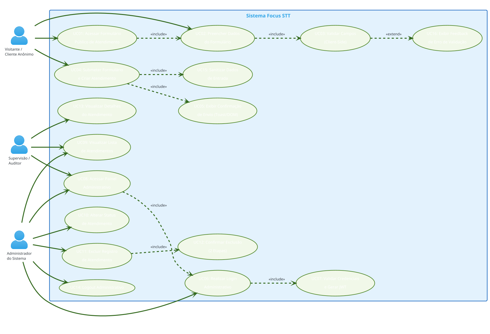
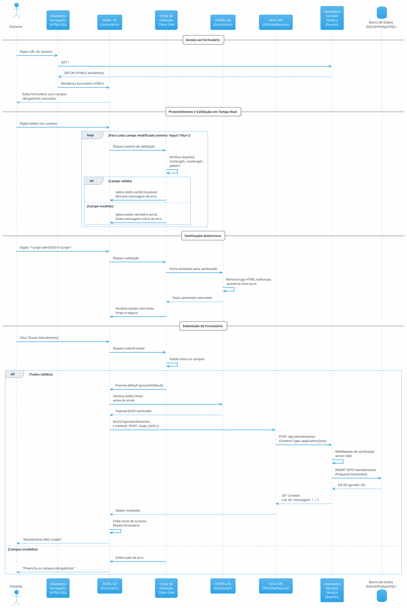
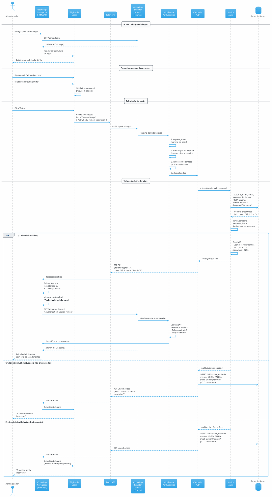
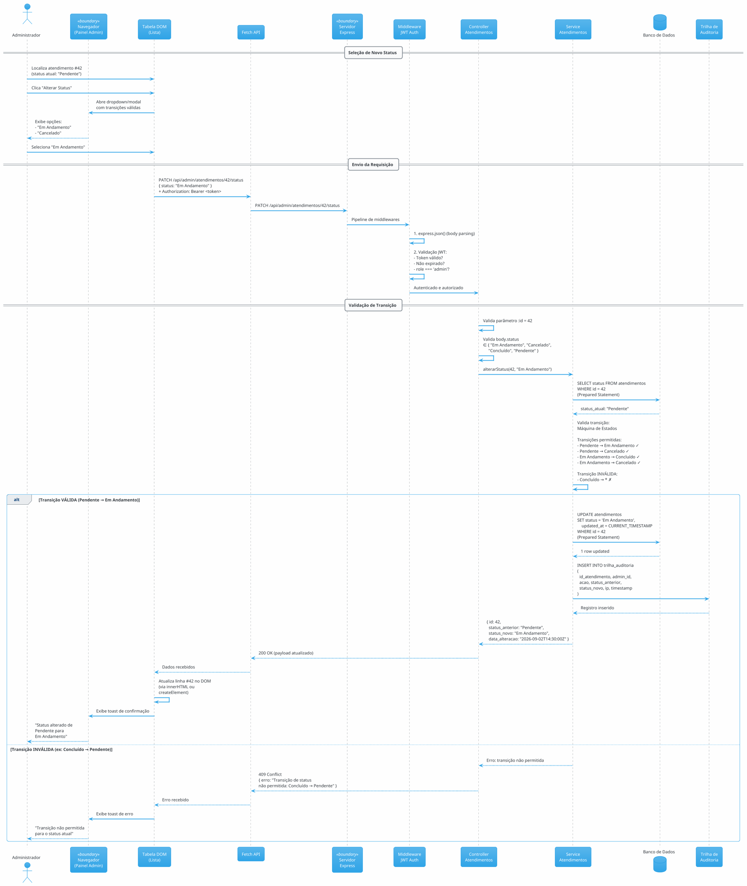
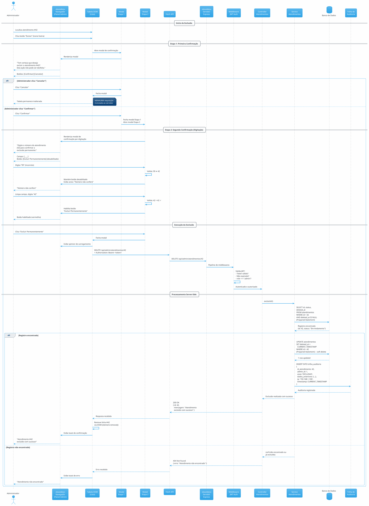

# Requisitos de Usuário — Sistema Focus STT

**Projeto:** Focus STT — Plataforma Full-Stack de Gestão de Atendimentos  
**Normas de Referência:** OMG UML 2.5.1, ISO/IEC/IEEE 29148:2018, ISO/IEC 25010  
**Versão do Documento:** 1.0.0  
**Data de Emissão:** 02/09/2026  
**Classificação:** Documento de Requisitos de Usuário (User Requirements)  
**Stack Tecnológica:** HTML5 Semântico, CSS3, JavaScript Vanilla/ES6+, Node.js, Express, SQLite/PostgreSQL  

---

## Sumário

1. [Identificação dos Atores do Sistema](#1-identificação-dos-atores-do-sistema)
2. [Diagrama de Casos de Uso](#2-diagrama-de-casos-de-uso)
3. [Catálogo de Requisitos de Usuário (RU)](#3-catálogo-de-requisitos-de-usuário-ru)
4. [Histórias de Usuário e Critérios de Aceite (BDD/Gherkin)](#4-histórias-de-usuário-e-critérios-de-aceite-bddgherkin)
5. [Diagramas de Sequência Orientados ao Usuário](#5-diagramas-de-sequência-orientados-ao-usuário)

---

## 1. Identificação dos Atores do Sistema

Conforme a especificação OMG UML 2.5.1 (Seção 18.2 — Use Cases), um **ator** representa uma entidade externa que interage com o sistema e participa de ao menos um caso de uso. Os atores são classificados conforme sua origem e papel.

### 1.1 Atores Humanos Primários

| ID | Nome do Ator | Descrição | Estereótipo UML | Capabilities |
|----|-------------|-----------|-----------------|--------------|
| **AH-P01** | **Visitante / Cliente Anônimo** | Indivíduo não autenticado que acessa o formulário público de abertura de atendimento para registrar uma nova demanda, solicitação ou ocorrência. Não possui credenciais de acesso ao painel administrativo. | `«primary»` `«human»` | Acessar o formulário público; Preencher campos do formulário; Enviar dados para criação de atendimento; Receber confirmação visual (Toast/DOM). |
| **AH-P02** | **Administrador do Sistema** | Profissional autenticado com credenciais válidas que possui autorização total sobre as operações de gestão de atendimentos: visualização, alteração de status, exclusão e acesso ao painel administrativo protegido por autenticação via JWT. | `«primary»` `«human»` | Autenticar-se via login; Visualizar lista de atendimentos; Alterar status de atendimentos; Excluir registros com confirmação; Acessar painel administrativo. |

### 1.2 Atores Humanos Secundários

| ID | Nome do Ator | Descrição | Estereótipo UML | Capabilities |
|----|-------------|-----------|-----------------|--------------|
| **AH-S01** | **Supervisão / Auditor** | Profissional com acesso somente-leitura ao painel administrativo para fins de auditoria, monitoramento de qualidade e supervisão operacional dos atendimentos registrados. | `«secondary»` `«human»` | Visualizar atendimentos; Consultar trilhas de auditoria; Gerar relatórios de acompanhamento. |

### 1.3 Atores Sistêmicos

| ID | Nome do Ator | Descrição | Estereótipo UML | Capabilities |
|----|-------------|-----------|-----------------|--------------|
| **AS-01** | **Banco de Dados (SQLite/PostgreSQL)** | Componente de persistência relacional que armazena, recupera e gerencia os dados dos atendimentos, usuários e trilhas de auditoria. Comunica-se com o backend via Prepared Statements e pool de conexões. | `«system»` `«external»` | Executar queries parametrizadas; Armazenar registros; Retornar resultados; Garantir integridade referencial; Manter transações ACID. |
| **AS-02** | **Runtime Node.js (V8 Engine)** | Ambiente de execução server-side que processa as requisições HTTP recebidas via Express, executa middlewares, controllers, services e models, e gerencia o Event Loop não-bloqueante de I/O assíncrono. | `«system»` `«runtime»` | Processar rotas HTTP; Executar middlewares; Gerenciar Event Loop; Pool de threads libuv. |
| **AS-03** | **Navegador do Cliente (User-Agent)** | Software cliente (Chrome, Firefox, Edge, Safari) que renderiza a interface HTML5 semântica, executa JavaScript vanilla/ES6+, processa validações client-side, sanitização DOM e apresenta feedback visual ao usuário. | `«system»` `«boundary»` | Renderizar HTML5; Executar JS; Validar formulários; Exibir feedback DOM/Toast; Gerenciar cookies e tokens. |
| **AS-04** | **CDN de Recursos Estáticos** | Rede de distribuição de conteúdo que entrega bibliotecas externas (se houver), fontes e recursos estáticos para o frontend. | `«system»` `«external»` | Servir arquivos estáticos; Cache de borda (edge cache); CDN. |

---

## 2. Diagrama de Casos de Uso

### 2.1 Diagrama de Casos de Uso Completo (PlantUML)



### 2.2 Descrição dos Relacionamentos

| Relacionamento | Tipo | Justificativa |
|---------------|------|---------------|
| UC01 → UC02 | `<<include>>` | O caso "Acessar Formulário" sempre inclui o caso "Preencher Dados" como comportamento obrigatório. |
| UC02 → UC03 | `<<include>>` | Todo preenchimento de dados inclui validação client-side dos campos. |
| UC04 → UC15 | `<<include>>` | A submissão do formulário sempre inclui sanitização dos dados de entrada. |
| UC04 → UC05 | `<<include>>` | Após submissão bem-sucedida, a exibição de confirmação (Toast) é obrigatória. |
| UC03 → UC16 | `<<extend>>` | Se a validação client-side falhar, opcionalmente o sistema estende o fluxo para exibir feedback de erro. |
| UC06 → UC07 | `<<include>>` | O login administrativo sempre inclui validação de credenciais e geração de JWT. |
| UC08 → UC06 | `<<include>>` | Acessar o painel administrativo requer autenticação prévia. |
| UC11 → UC12 | `<<include>>` | Excluir um registro sempre inclui o fluxo de confirmação em duas etapas. |

---

## 3. Catálogo de Requisitos de Usuário (RU)

### 3.1 RU-01: Acessar Formulário Público de Atendimento

| Campo | Valor |
|-------|-------|
| **Identificador** | RU-01 |
| **Caso de Uso Associado** | UC01, UC02 |
| **Ator Principal** | AH-P01 (Visitante / Cliente Anônimo) |
| **Prioridade (MoSCoW)** | **Must Have** |
| **Pré-condições** | (1) O Visitante possui acesso a um navegador web moderno (Chrome 90+, Firefox 88+, Edge 90+, Safari 14+). (2) A URL pública do formulário está acessível e o servidor Node.js está em execução. (3) O formulário HTML5 está disponível no endpoint público `/`. |
| **Fluxo Operacional** | **Passo 1:** O Visitante abre o navegador e navega até a URL base do sistema. **Passo 2:** O navegador solicita o recurso HTML5 semântico via GET `/`. **Passo 3:** O servidor Express responde com o documento HTML5 contendo o formulário de abertura de atendimento. **Passo 4:** O navegador renderiza o formulário com campos semanticamente marcados (`<form>`, `<label>`, `<input>`, `<textarea>`, `<select>`). **Passo 5:** O Visitante visualiza o formulário com todos os campos obrigatórios indicados por asterisco e instruções de preenchimento. **Passo 6:** O Visitante interage com o formulário preenchendo os campos. **Passo 7:** Validações client-side são acionadas em tempo real conforme o Visitante preenche os campos (required, minlength, maxlength, pattern). **Passo 8:** Se algum campo obrigatório estiver vazio ou com formato inválido, feedback visual é exibido inline (borda vermelha, mensagem de erro). **Passo 9:** Quando todos os campos obrigatórios estiverem válidos, o botão de envio é habilitado. **Passo 10:** O Visitante clica no botão "Enviar Atendimento". **Passo 11:** Script JS intercepta o `submit` event, previne o `default`, sanitiza os dados via DOMPurify e envia requisição POST assíncrona via `fetch()` para `/api/atendimentos`. **Passo 12:** O servidor valida, sanitiza e persiste os dados no banco relacional. **Passo 13:** O servidor retorna status HTTP 201 com payload JSON de confirmação. **Passo 14:** O script JS exibe toast de sucesso via DOM e reseta o formulário. |
| **Pós-condições** | **SUCESSO:** O formulário é acessível; os dados são validados client-side; os dados são submetidos e persistidos no banco; confirmação visual é exibida. **FALHA:** Se o servidor não estiver disponível, erro de rede é exibido ao Visitante. |

### 3.2 RU-02: Validar Campos do Formulário (Client-Side)

| Campo | Valor |
|-------|-------|
| **Identificador** | RU-02 |
| **Caso de Uso Associado** | UC03, UC16 |
| **Ator Principal** | AH-P01 (Visitante / Cliente Anônimo) |
| **Prioridade (MoSCoW)** | **Must Have** |
| **Pré-condições** | (1) O Visitante está na página do formulário público. (2) O script JavaScript de validação está carregado e executável. |
| **Fluxo Operacional** | **Passo 1:** O Visitante foca em um campo do formulário (evento `focus`). **Passo 2:** O Visitante digita ou seleciona um valor no campo. **Passo 3:** Ao perder o foco (evento `blur`) ou durante a digitação (evento `input`), o script de validação client-side é acionado. **Passo 4:** O script verifica: (a) campos obrigatórios (`required`); (b) comprimento mínimo/máximo (`minlength`, `maxlength`); (c) formato de e-mail (`pattern`); (d) telefone (`pattern`); (e) campos de seleção obrigatórios. **Passo 5:** Se o valor for válido: o campo recebe estilo visual de sucesso (borda verde) e mensagem inline de confirmação é ocultada. **Passo 6:** Se o valor for inválido: o campo recebe estilo visual de erro (borda vermelha, fundo rosa claro) e mensagem inline descritiva é exibida via DOM. **Passo 7:** Validação assíncrona de sanitização é acionada para detectar tentativas de XSS nos campos de texto livre (sanitização DOMPurify). **Passo 8:** Se conteúdo malicioso for detectado, o campo é marcado como inválido e o Visitante é alertado. |
| **Pós-condições** | **SUCESSO:** Todos os campos são validados em tempo real; feedback visual é apresentado; tentativas de XSS são neutralizadas. **FALHA:** Se o script de validação não puder ser executado (JS desabilitado), o formulário仍 funciona via validação server-side. |

### 3.3 RU-03: Submeter Formulário e Criar Atendimento

| Campo | Valor |
|-------|-------|
| **Identificador** | RU-03 |
| **Caso de Uso Associado** | UC04, UC15, UC05 |
| **Ator Principal** | AH-P01 (Visitante / Cliente Anônimo) |
| **Prioridade (MoSCoW)** | **Must Have** |
| **Pré-condições** | (1) Todos os campos obrigatórios do formulário estão preenchidos e validados client-side. (2) O Visitante não está bloqueado por rate limiting. (3) O endpoint POST `/api/atendimentos` está disponível. |
| **Fluxo Operacional** | **Passo 1:** O Visitante clica no botão "Enviar Atendimento" (evento `click`). **Passo 2:** Script JS intercepta o evento `submit` e executa `event.preventDefault()`. **Passo 3:** Script coleta os valores dos campos do formulário via `FormData` ou seletores DOM. **Passo 4:** Script sanitiza os dados de entrada usando DOMPurify ou express-validator equivalent client-side (remoção de tags HTML, escape de caracteres especiais). **Passo 5:** Script constrói payload JSON com os dados sanitizados. **Passo 6:** Script exibe estado de carregamento no botão (desabilita botão, exibe spinner CSS). **Passo 7:** Script envia requisição HTTP POST via `fetch('/api/atendimentos', { method: 'POST', headers: {'Content-Type': 'application/json'}, body: JSON.stringify(dados) })`. **Passo 8:** O Express recebe a requisição na rota POST `/api/atendimentos`. **Passo 9:** Middleware de sanitização server-side valida e sanitiza o payload. **Passo 10:** Controller invoca Service que insere o registro via Prepared Statement no banco. **Passo 11:** Banco confirma inserção e retorna ID gerado. **Passo 12:** Controller retorna HTTP 201 com `{ id, mensagem: "Atendimento criado com sucesso" }`. **Passo 13:** Script JS recebe resposta, exibe toast de sucesso via DOM e reseta o formulário. |
| **Pós-condições** | **SUCESSO:** Atendimento criado no banco com status inicial "Pendente"; confirmação visual exibida ao Visitante. **FALHA:** Se o servidor retornar 400 (dados inválidos), toast de erro é exibido com detalhes. Se retornar 500, toast de erro genérico é exibido. |

### 3.4 RU-04: Realizar Login Administrativo

| Campo | Valor |
|-------|-------|
| **Identificador** | RU-04 |
| **Caso de Uso Associado** | UC06, UC07 |
| **Ator Principal** | AH-P02 (Administrador do Sistema) |
| **Prioridade (MoSCoW)** | **Must Have** |
| **Pré-condições** | (1) O Administrador possui credenciais válidas registradas no sistema (e-mail e senha). (2) A página de login está acessível em `/login` ou `/admin/login`. (3) O endpoint POST `/api/auth/login` está disponível. |
| **Fluxo Operacional** | **Passo 1:** O Administrador navega até a página de login (`/admin/login`). **Passo 2:** O navegador renderiza o formulário de login com campos: e-mail (`<input type="email">`) e senha (`<input type="password">`). **Passo 3:** O Administrador preenche o campo de e-mail. **Passo 4:** O Administrador preenche o campo de senha. **Passo 5:** Validações client-side verificam formato do e-mail e presença do campo senha. **Passo 6:** O Administrador clica no botão "Entrar". **Passo 7:** Script JS coleta credenciais, sanitiza inputs e envia POST para `/api/auth/login` com payload `{ email, password }`. **Passo 8:** O Express recebe a requisição na rota de autenticação. **Passo 9:** Middleware de sanitização valida o payload. **Passo 10:** Controller de autenticação busca o usuário pelo e-mail no banco via Prepared Statement. **Passo 11:** Se o usuário não existir, retorna HTTP 401 com mensagem genérica (não expor existência do usuário). **Passo 12:** Se o usuário existir, compara a senha fornecida com o hash armazenado usando bcrypt/argon2 com verificação de timing-safe. **Passo 13:** Se as credenciais forem válidas, gera JSON Web Token (JWT) com payload `{ userId, role, iat, exp }` e assinatura HS256/RS256. **Passo 14:** Retorna HTTP 200 com `{ token, user: { id, name, email, role } }`. **Passo 15:** Script JS armazena o token em `localStorage` ou cookie HTTP-Only. **Passo 16:** Script JS redireciona o Administrador para o painel administrativo (`/admin/dashboard`). **Passo 17:** Página do painel é carregada com token de autenticação no cabeçalho `Authorization: Bearer <token>`. |
| **Pós-condições** | **SUCESSO:** Administrador autenticado com JWT válido; redirecionado ao painel administrativo; sessão iniciada. **FALHA:** Se credenciais inválidas: HTTP 401; toast de erro "E-mail ou senha incorretos"; permanência na tela de login (número de tentativas é registrado em trilha de auditoria). |

### 3.5 RU-05: Acessar Painel Administrativo

| Campo | Valor |
|-------|-------|
| **Identificador** | RU-05 |
| **Caso de Uso Associado** | UC08, UC09 |
| **Ator Principal** | AH-P02 (Administrador do Sistema) |
| **Prioridade (MoSCoW)** | **Must Have** |
| **Pré-condições** | (1) O Administrador está autenticado com JWT válido. (2) O token não expirou. (3) O endpoint GET `/api/admin/atendimentos` está disponível. |
| **Fluxo Operacional** | **Passo 1:** Após login, o navegador redireciona para `/admin/dashboard`. **Passo 2:** Script JS envia GET `/api/admin/atendimentos` com header `Authorization: Bearer <token>`. **Passo 3:** Middleware de autenticação JWT valida o token no servidor. **Passo 4:** Se o token for válido, o controller busca todos os atendimentos no banco. **Passo 5:** Se o token for inválido/expirado, retorna HTTP 401 e redireciona para `/admin/login`. **Passo 6:** Dados retornados (JSON array) são renderizados em tabela HTML dinâmica via DOM. **Passo 7:** Tabela exibe: ID, Nome do Solicitante, Tipo, Status, Data de Criação, Botões de Ação. **Passo 8:** Paginação é aplicada se houver mais de 10 registros (10 por página). **Passo 9:** O Administrador pode usar filtros por status, tipo e data de criação. |
| **Pós-condições** | **SUCESSO:** Lista de atendimentos é exibida; dados atualizados são apresentados. **FALHA:** Se o token expirar durante a navegação, redirecionamento automático para login. |

### 3.6 RU-06: Alterar Status de Atendimento

| Campo | Valor |
|-------|-------|
| **Identificador** | RU-06 |
| **Caso de Uso Associado** | UC10 |
| **Ator Principal** | AH-P02 (Administrador do Sistema) |
| **Prioridade (MoSCoW)** | **Must Have** |
| **Pré-condições** | (1) O Administrador está autenticado com JWT válido. (2) Pelo menos um atendimento existe no sistema. (3) O status atual do atendimento permite transição (regras de transição de estado). |
| **Fluxo Operacional** | **Passo 1:** O Administrador localiza o atendimento na lista do painel. **Passo 2:** O Administrador clica no botão/ícone de "Alterar Status" correspondente ao atendimento. **Passo 3:** Um dropdown ou modal é exibido com as transições de status válidas para o status atual (ex: Pendente → Em Andamento, Em Andamento → Concluído, Pendente → Cancelado). **Passo 4:** O Administrador seleciona o novo status desejado. **Passo 5:** Script JS coleta o ID do atendimento e o novo status. **Passo 6:** Script JS envia PATCH `/api/admin/atendimentos/:id/status` com payload `{ status: "novo_status" }` e header `Authorization: Bearer <token>`. **Passo 7:** Middleware de autenticação valida o token. **Passo 8:** Controller valida se a transição de status é permitida (regra de máquina de estados). **Passo 9:** Se a transição for inválida, retorna HTTP 409 Conflict com mensagem descritiva. **Passo 10:** Se a transição for válida, Service atualiza o status no banco via Prepared Statement. **Passo 11:** Service registra entrada na trilha de auditoria (quem, quando, de qual status, para qual status). **Passo 12:** Banco confirma atualização. **Passo 13:** Controller retorna HTTP 200 com `{ id, status_anterior, status_novo, data_alteracao }`. **Passo 14:** Script JS atualiza dinamicamente a linha da tabela no DOM sem recarregar a página (atualização otimista ou via refetch). **Passo 15:** Toast de confirmação é exibido: "Status alterado de [anterior] para [novo] com sucesso". |
| **Pós-condições** | **SUCESSO:** Status atualizado no banco; trilha de auditoria registrada; UI atualizada; toast exibido. **FALHA:** Se a transição for inválida (violação de regra de máquina de estados), toast de erro com mensagem explicativa. |

### 3.7 RU-07: Excluir Registro de Atendimento

| Campo | Valor |
|-------|-------|
| **Identificador** | RU-07 |
| **Caso de Uso Associado** | UC11, UC12 |
| **Ator Principal** | AH-P02 (Administrador do Sistema) |
| **Prioridade (MoSCoW)** | **Must Have** |
| **Pré-condições** | (1) O Administrador está autenticado com JWT válido. (2) Pelo menos um atendimento existe no sistema. |
| **Fluxo Operacional** | **Passo 1:** O Administrador localiza o atendimento a ser excluído na lista do painel. **Passo 2:** O Administrador clica no botão/ícone de "Excluir" (ícone de lixeira vermelho). **Passo 3:** Script JS exibe modal de confirmação **Etapa 1** (Primeira Camada de Proteção): "Tem certeza que deseja excluir o atendimento #<ID>? Esta ação não pode ser desfeita." com botões "Confirmar" e "Cancelar". **Passo 4:** O Administrador clica em "Confirmar". **Passo 5:** Script JS exibe modal de confirmação **Etapa 2** (Segunda Camada de Proteção): "Digite o número do atendimento (#<ID>) para confirmar a exclusão permanente:" com campo de input numérico e botões "Excluir Permanentemente" (desabilitado até digitação correta) e "Cancelar". **Passo 6:** O Administrador digita o número do atendimento no campo de confirmação. **Passo 7:** Script JS valida se o número digitado confere com o ID do atendimento. Se conferir, habilita o botão "Excluir Permanentemente". **Passo 8:** O Administrador clica em "Excluir Permanentemente". **Passo 9:** Script JS fecha o modal, exibe spinner de carregamento e envia DELETE `/api/admin/atendimentos/:id` com header `Authorization: Bearer <token>`. **Passo 10:** Middleware de autenticação valida o token. **Passo 11:** Controller verifica se o registro existe no banco via Prepared Statement. **Passo 12:** Se não existir, retorna HTTP 404 Not Found. **Passo 13:** Se existir, Service executa exclusão lógica (soft delete: `SET deleted_at = CURRENT_TIMESTAMP`) ou exclusão física conforme configuração. **Passo 14:** Service registra entrada na trilha de auditoria (quem, quando, qual registro foi excluído). **Passo 15:** Banco confirma exclusão. **Passo 16:** Controller retorna HTTP 200 com `{ id, mensagem: "Atendimento excluído com sucesso" }`. **Passo 17:** Script JS remove a linha da tabela via DOM (`element.remove()`) e exibe toast de confirmação: "Atendimento #<ID> excluído com sucesso". |
| **Pós-condições** | **SUCESSO:** Registro excluído (logicamente ou fisicamente) no banco; trilha de auditoria registrada; linha removida da UI; toast exibido. **FALHA:** Se o registro não for encontrado, toast de erro "Atendimento não encontrado". Se o token expirar, redirecionamento para login. |

### 3.8 RU-08: Realizar Logout Administrativo

| Campo | Valor |
|-------|-------|
| **Identificador** | RU-08 |
| **Caso de Uso Associado** | UC14 |
| **Ator Principal** | AH-P02 (Administrador do Sistema) |
| **Prioridade (MoSCoW)** | **Must Have** |
| **Pré-condições** | (1) O Administrador está autenticado e no painel administrativo. |
| **Fluxo Operacional** | **Passo 1:** O Administrador clica no botão/link "Sair" na interface. **Passo 2:** Script JS remove o token JWT do `localStorage` ou cookies. **Passo 3:** Script JS redireciona o navegador para `/admin/login`. **Passo 4:** Se houver token HTTP-Only cookie, o servidor invalida o cookie via `Set-Cookie` com `Max-Age=0`. **Passo 5:** O navegador renderiza a página de login. |
| **Pós-condições** | **SUCESSO:** Token removido; sessão encerrada; redirecionamento para login. |

### 3.9 RU-09: Visualizar Detalhes do Atendimento

| Campo | Valor |
|-------|-------|
| **Identificador** | RU-09 |
| **Caso de Uso Associado** | UC13 |
| **Ator Principal** | AH-P02 (Administrador do Sistema) / AH-S01 (Supervisão/Auditor) |
| **Prioridade (MoSCoW)** | **Should Have** |
| **Pré-condições** | (1) O usuário está autenticado com JWT válido. (2) O atendimento existe no banco. |
| **Fluxo Operacional** | **Passo 1:** O usuário clica no botão "Ver Detalhes" ou no ID do atendimento na tabela. **Passo 2:** Script JS envia GET `/api/admin/atendimentos/:id` com header `Authorization: Bearer <token>`. **Passo 3:** Controller busca o atendimento por ID no banco via Prepared Statement. **Passo 4:** Controller retorna HTTP 200 com objeto JSON contendo todos os campos do atendimento. **Passo 5:** Script JS renderiza modal ou página de detalhes com: dados do solicitante, tipo, descrição completa, status atual, histórico de alterações de status e trilha de auditoria. **Passo 6:** Botão "Voltar" fecha o modal ou redireciona para a lista. |
| **Pós-condições** | **SUCESSO:** Detalhes completos do atendimento são exibidos. **FALHA:** Se o atendimento não for encontrado, toast de erro e retorno à lista. |

---

## 4. Histórias de Usuário e Critérios de Aceite (BDD/Gherkin)

### 4.1 HU-01: Formulário Público de Abertura de Atendimento

**Como** Visitante/Cliente Anônimo,  
**Eu quero** acessar um formulário público na web para registrar minha demanda de atendimento,  
**Para que** meu pedido seja registrado e possa ser processado pela equipe administrativa.

#### Critérios de Aceite

```gherkin
Funcionalidade: Formulário Público de Abertura de Atendimento
  Como visitante do sistema
  Quero acessar e preencher um formulário público
  Para criar um novo atendimento

  Cenário: Acesso bem-sucedido ao formulário público
    Dado que o visitante está com um navegador web aberto
    Quando o visitante navega para a URL base do sistema
    E o servidor Node.js está em execução e acessível
    Então o formulário HTML5 semântico é renderizado na tela
    E todos os campos obrigatórios são indicados visualmente
    E o botão "Enviar Atendimento" está visível

  Cenário: Validação de campos obrigatórios em tempo real
    Dado que o visitante está no formulário público
    Quando o visitante tenta submeter o formulário com campos obrigatórios vazios
    Então mensagens de erro são exibidas abaixo de cada campo obrigatório vazio
    E o formulário NÃO é submetido ao servidor
    E o botão de envio permanece desabilitado até validação

  Cenário: Validação de formato de e-mail
    Dado que o visitante está no campo "E-mail" do formulário
    Quando o visitante digita "email_invalido" (sem @ e domínio)
    E o visitante perde o foco do campo
    Então uma mensagem de erro é exibida: "Por favor, insira um e-mail válido"
    E o campo é destacado com borda vermelha

  Cenário: Sanitização de entrada contra XSS
    Dado que o visitante está no campo "Descrição" do formulário
    Quando o visitante digita "<script>alert('XSS')</script>" no campo
    Então o script de sanitização DOMPurify remove a tag maliciosa
    E o texto exibido no campo contém apenas texto puro sem tags HTML
```

### 4.2 HU-02: Submissão e Criação de Atendimento

**Como** Visitante/Cliente Anônimo,  
**Eu quero** submeter o formulário preenchido e receber confirmação do recebimento,  
**Para que** eu tenha certeza de que minha demanda foi registrada no sistema.

#### Critérios de Aceite

```gherkin
Funcionalidade: Submissão e Criação de Atendimento
  Como visitante que preencheu o formulário
  Quero submeter meus dados e receber confirmação
  Para saber que meu atendimento foi criado

  Cenário: Submissão bem-sucedida com dados válidos
    Dado que o visitante preencheu todos os campos obrigatórios corretamente
    Quando o visitante clica no botão "Enviar Atendimento"
    Então uma requisição HTTP POST é enviada para "/api/atendimentos"
    E o payload contém os dados sanitizados em formato JSON
    E o servidor retorna status HTTP 201
    E um toast de confirmação é exibido: "Atendimento criado com sucesso!"
    E o formulário é resetado para o estado inicial
    E o botão de envio retorna ao estado habilitado

  Cenário: Falha na submissão por erro do servidor
    Dado que o visitante preencheu todos os campos obrigatórios
    Quando o servidor retorna status HTTP 500 (erro interno)
    Então um toast de erro é exibido: "Erro ao enviar. Tente novamente."
    E os dados do formulário NÃO são perdidos
    E o botão de envio retorna ao estado habilitado

  Cenário: Falha na submissão por dados inválidos
    Dado que o visitante preencheu campos com dados que violam as regras de validação server-side
    Quando o servidor retorna status HTTP 400 com lista de erros
    Então um toast de erro é exibido com as mensagens de validação
    E os campos com erro são destacados visualmente
```

### 4.3 HU-03: Login Administrativo com JWT

**Como** Administrador do Sistema,  
**Eu quero** autenticar-me com meu e-mail e senha para acessar o painel administrativo,  
**Para que** eu possa gerenciar os atendimentos de forma segura.

#### Critérios de Aceite

```gherkin
Funcionalidade: Login Administrativo com JWT
  Como administrador do sistema
  Quero fazer login com credenciais válidas
  Para acessar o painel administrativo seguro

  Cenário: Login bem-sucedido
    Dado que o administrador está na página de login "/admin/login"
    E o administrador possui credenciais válidas registradas
    Quando o administrador preenche o campo "E-mail" com "admin@exemplo.com"
    E o administrador preenche o campo "Senha" com a senha correta
    E o administrador clica no botão "Entrar"
    Então uma requisição HTTP POST é enviada para "/api/auth/login"
    E o servidor valida as credenciais contra o banco de dados
    E o servidor retorna status HTTP 200 com token JWT
    E o token é armazenado em localStorage ou cookie HTTP-Only
    E o navegador redireciona para "/admin/dashboard"
    E o painel administrativo é carregado com os dados de atendimentos

  Cenário: Falha no login por credenciais inválidas
    Dado que o administrador está na página de login
    Quando o administrador insere e-mail ou senha incorretos
    E clica no botão "Entrar"
    Então o servidor retorna status HTTP 401
    E um toast de erro é exibido: "E-mail ou senha incorretos"
    E NENHUMA informação sobre qual campo está incorreto é exposta
    E o administrador permanece na página de login

  Cenário: Falha no login por campos obrigatórios vazios
    Dado que o administrador está na página de login
    Quando o administrador clica "Entrar" com campos vazios
    Então validações client-side bloqueiam o envio
    E mensagens de erro são exibidas nos campos obrigatórios
```

### 4.4 HU-04: Alteração de Status de Atendimento

**Como** Administrador do Sistema,  
**Eu quero** alterar o status de um atendimento para acompanhar seu progresso,  
**Para que** a equipe saiba em qual etapa cada atendimento se encontra.

#### Critérios de Aceite

```gherkin
Funcionalidade: Alteração de Status de Atendimento
  Como administrador autenticado
  Quero alterar o status de um atendimento
  Para atualizar sua situação operacional

  Cenário: Transição de status válida
    Dado que o administrador está autenticado no painel administrativo
    E existe um atendimento com status "Pendente" (ID: 42)
    Quando o administrador seleciona o novo status "Em Andamento" para o atendimento #42
    Então uma requisição HTTP PATCH é enviada para "/api/admin/atendimentos/42/status"
    E o payload contém { "status": "Em Andamento" }
    E o servidor valida a transição (Pendente → Em Andamento é permitida)
    E o servidor retorna status HTTP 200 com { status_anterior: "Pendente", status_novo: "Em Andamento" }
    E a tabela é atualizada dinamicamente sem reload da página
    E um toast é exibido: "Status alterado de Pendente para Em Andamento"
    E uma entrada é registrada na trilha de auditoria

  Cenário: Transição de status inválida
    Dado que o administrador está autenticado no painel
    E existe um atendimento com status "Concluído" (ID: 43)
    Quando o administrador tenta alterar o status de "Concluído" para "Pendente"
    Then o servidor retorna HTTP 409 Conflict
    E a mensagem informa que essa transição não é permitida
    E a tabela permanece inalterada
    E um toast de erro é exibido

  Cenário: Tentativa de alteração sem autenticação
    Dado que o token JWT do administrador expirou
    Quando o administrador tenta alterar o status de um atendimento
    Então o servidor retorna HTTP 401 Unauthorized
    E o navegador redireciona para "/admin/login"
```

### 4.5 HU-05: Exclusão Segura de Atendimento com Confirmação em Duas Etapas

**Como** Administrador do Sistema,  
**Eu quero** excluir um atendimento com dupla confirmação para evitar exclusões acidentais,  
**Para que** registros importantes não sejam removidos sem intenção deliberada.

#### Critérios de Aceite

```gherkin
Funcionalidade: Exclusão Segura com Confirmação em 2 Etapas
  Como administrador autenticado
  Quero excluir um atendimento com dupla confirmação
  Para evitar exclusões acidentais

  Cenário: Exclusão confirmada com sucesso
    Dado que o administrador está autenticado no painel
    E existe um atendimento com ID 42
    Quando o administrador clica no botão "Excluir" do atendimento #42
    Então um modal Etapa 1 é exibido: "Tem certeza que deseja excluir o atendimento #42?"
    Quando o administrador clica "Confirmar"
    Então um modal Etapa 2 é exibido: "Digite o número do atendimento (42) para confirmar"
    E o botão "Excluir Permanentemente" está desabilitado
    Quando o administrador digita "42" no campo de confirmação
    Então o botão "Excluir Permanentemente" é habilitado
    Quando o administrador clica "Excluir Permanentemente"
    Então uma requisição HTTP DELETE é enviada para "/api/admin/atendimentos/42"
    E o servidor retorna HTTP 200
    E a linha do atendimento é removida da tabela via DOM
    E um toast é exibido: "Atendimento #42 excluído com sucesso"
    E uma entrada é registrada na trilha de auditoria

  Cenário: Cancelamento da exclusão na Etapa 1
    Dado que o modal Etapa 1 está aberto para o atendimento #42
    Quando o administrador clica "Cancelar"
    Então o modal é fechado
    E NENHUMA requisição é enviada ao servidor
    E a tabela permanece inalterada

  Cenário: Cancelamento da exclusão na Etapa 2
    Dado que o modal Etapa 2 está aberto para o atendimento #42
    Quando o administrador clica "Cancelar"
    Então o modal é fechado
    E NENHUMA requisição é enviada ao servidor
    E a tabela permanece inalterada

  Cenário: Digitação incorreta na Etapa 2
    Dado que o modal Etapa 2 está aberto para o atendimento #42
    Quando o administrador digita "99" (número incorreto) no campo
    Então o botão "Excluir Permanentemente" permanece desabilitado
    E uma mensagem de aviso é exibida: "Número não confere"
```

### 4.6 HU-06: Visualização de Lista de Atendimentos com Paginação

**Como** Administrador do Sistema,  
**Eu quero** visualizar uma lista paginada e filtrável de todos os atendimentos,  
**Para que** eu possa acompanhar e gerenciar as demandas de forma eficiente.

#### Critérios de Aceite

```gherkin
Funcionalidade: Visualização de Lista de Atendimentos
  Como administrador autenticado
  Quero ver uma lista paginada de atendimentos
  Para gerenciar as demandas registradas

  Cenário: Carregamento da lista com dados
    Dado que o administrador está autenticado
    Quando o painel administrativo é carregado
    Então uma tabela com atendimentos é exibida
    E cada linha contém: ID, Nome, Tipo, Status, Data, Ações
    E a paginação é exibida na parte inferior (10 itens por página)

  Cenário: Filtragem por status
    Dado que existem atendimentos com diferentes status
    Quando o administrador seleciona o filtro "Pendente" no campo de status
    Então apenas atendimentos com status "Pendente" são exibidos
    E a paginação é recalculada

  Cenário: Navegação entre páginas
    Dado que existem mais de 10 atendimentos
    Quando o administrador clica na página "2" da paginação
    Então os atendimentos da segunda página são exibidos
    E o indicador de página atual é atualizado
```

### 4.7 HU-07: Logout Seguro

**Como** Administrador do Sistema,  
**Eu quero** encerrar minha sessão de forma segura,  
**Para que** meu acesso administrativo não permaneça aberto após uso.

#### Critérios de Aceite

```gherkin
Funcionalidade: Logout Seguro
  Como administrador autenticado
  Quero fazer logout para encerrar minha sessão
  Para garantir segurança do sistema

  Cenário: Logout bem-sucedido
    Dado que o administrador está autenticado no painel
    Quando o administrador clica no botão "Sair"
    Então o token JWT é removido do armazenamento do cliente
    E o navegador redireciona para "/admin/login"
    E tentativas de acesso a rotas protegidas retornam HTTP 401

  Cenário: Acesso após logout
    Dado que o administrador fez logout
    Quando o administrador tenta navegar diretamente para "/admin/dashboard"
    Então o navegador redireciona para "/admin/login"
    E nenhum dado administrativo é acessível
```

---

## 5. Diagramas de Sequência Orientados ao Usuário

### 5.1 Diagrama de Sequência: Formulário Público com Validação Client-Side e Sanitização Assíncrona



### 5.2 Diagrama de Sequência: Login Administrativo com Sessão/Token e Redirecionamento



### 5.3 Diagrama de Sequência: Alteração Operacional de Status de Atendimento



### 5.4 Diagrama de Sequência: Exclusão Segura com Diálogo Modal de Confirmação em Duas Etapas



---

## Rastreabilidade Requisitos → Casos de Uso → Diagramas de Sequência

| RU | Caso(s) de Uso | Diagrama de Sequência |
|----|----------------|----------------------|
| RU-01 | UC01, UC02 | DS 5.1 (Formulário Público) |
| RU-02 | UC03, UC16 | DS 5.1 (Formulário Público) |
| RU-03 | UC04, UC15, UC05 | DS 5.1 (Formulário Público) |
| RU-04 | UC06, UC07 | DS 5.2 (Login Administrativo) |
| RU-05 | UC08, UC09 | DS 5.2 (Login Administrativo) |
| RU-06 | UC10 | DS 5.3 (Alteração de Status) |
| RU-07 | UC11, UC12 | DS 5.4 (Exclusão Segura) |
| RU-08 | UC14 | DS 5.2 (Login Administrativo — logout) |
| RU-09 | UC13 | DS 5.3 (Alteração de Status — detalhes) |

---

**Fim do Documento — Requisitos de Usuário**  
**Versão:** 1.0.0 | **Norma:** ISO/IEC/IEEE 29148:2018 | **UML:** OMG 2.5.1 | **Qualidade:** FURPS+ / ISO 25010
